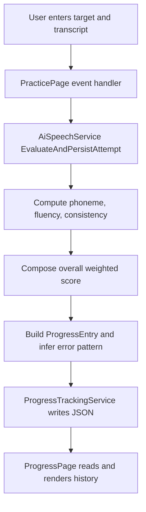
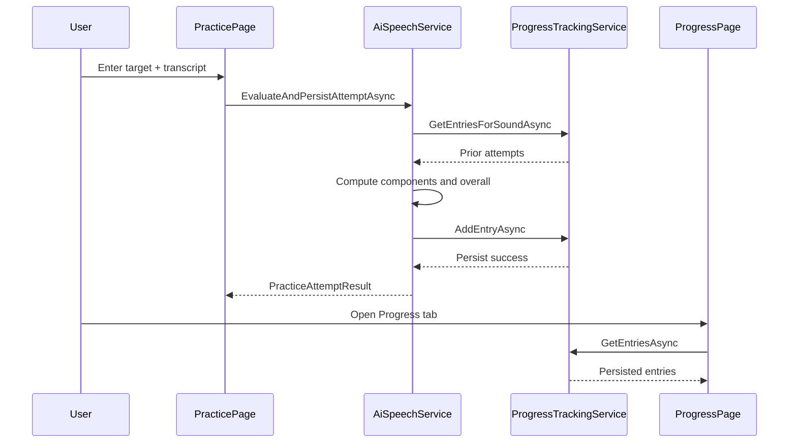
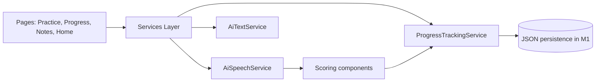
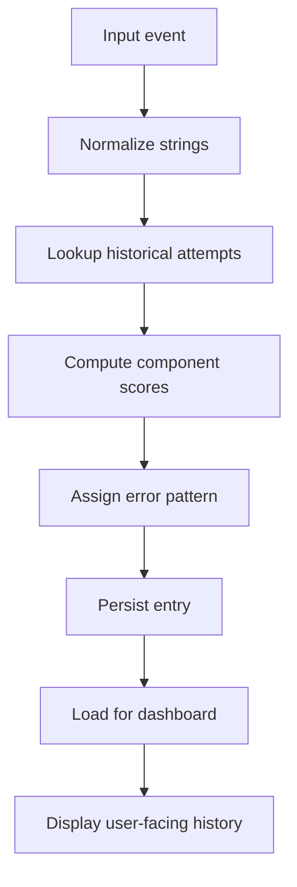
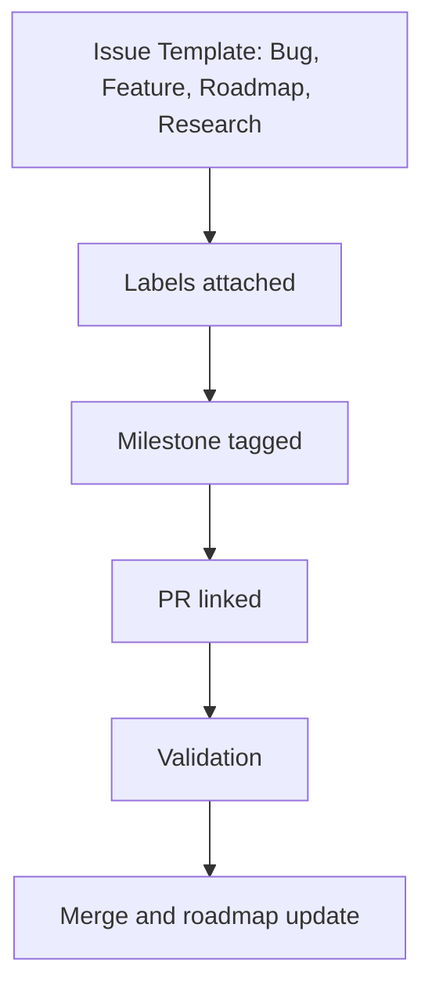

# SpeechBuddyAI


SpeechBuddyAI is a speech therapy companion focused on practical articulation workflows, transparent score components, and session-to-session progress tracking that can be reviewed by clinicians and families. The project is intentionally designed to avoid black-box behavior in early milestones, because trust and interpretability are central in speech practice tools.

This README is both a product guide and a technical implementation reference. It explains what the app does, why each subsystem exists, how scoring is computed, what tradeoffs were chosen, and which free public libraries or APIs are realistic for future expansion.

> [!IMPORTANT]
> SpeechBuddyAI is support software and is not a medical device. The outputs should assist therapy planning, not replace professional clinical decision-making.

## Table of Contents

1. What This Project Does
2. Fast Comparison Tables (Use/Do Not Use)
3. Current Milestone Status
4. Tech Stack and Architecture
5. Algorithms and Formulas
6. Public Libraries and API Strategy
7. Collapsible API Reference
8. GitHub Workflow and Tracking
9. Research Citations
10. Build, Run, and Practical Notes

## What This Project Does

SpeechBuddyAI supports a feedback loop where a learner practices a target sound, receives component-level scoring feedback, and stores attempts for trend review. In the current M1 implementation, the focus is not on maximizing model complexity, but on making the loop reliable and understandable.

The app currently demonstrates a complete vertical slice for M1. A user can enter a target sound and transcript, run scoring, see phoneme/fluency/consistency components, and persist the attempt. That same data appears in the progress dashboard so the practice loop produces longitudinal records instead of one-off scores.

> [!NOTE]
> M1 persistence is currently app-local JSON storage. SQLite remains a planned upgrade for subsequent milestones.

## Fast Comparison Tables (Use/Do Not Use)

These tables are intentionally near the top so new contributors can quickly pick the right technical direction before coding.

### Deployment and Inference Modes

| # | Option | What It Does | Use When | Do Not Use When | How It Works (High Level) |
| --- | --- | --- | --- | --- | --- |
| 1 | Offline-first STT | Runs recognition on device without sending audio to cloud | Privacy-sensitive workflows and poor connectivity | You require managed cloud diarization now | Capture audio -> local model inference -> score pipeline |
| 2 | Cloud STT | Delegates recognition to hosted API | Rapid iteration and broad language support | Strict local-only policy or high latency constraints | Capture audio -> upload -> cloud transcript -> score pipeline |
| 3 | Hybrid STT | Uses local path first and cloud fallback | Production resilience with mixed network conditions | Team cannot maintain two adapters yet | Try local -> if unavailable/fails use cloud -> continue scoring |

> [!TIP]
> For this codebase, hybrid is the long-term target, but offline-first should remain the default experience.

### Scoring Strategy Comparison

| # | Strategy | What It Measures | Best For | Not Ideal For | Why Chosen or Deferred |
| --- | --- | --- | --- | --- | --- |
| 1 | Rule-based component scoring | Phoneme match proxy, fluency proxy, consistency proxy | MVP reliability and explainability | Fine-grained phonetic diagnostics at scale | Chosen for M1 due transparency and low complexity |
| 2 | GOP-style scoring | Phoneme-level posterior contrast confidence | Targeted phone-level coaching and minimal pairs | Pipelines without phoneme alignment/lexicon | Planned as M2/M3 enhancement |
| 3 | Joint APA + MDD models | Overall pronunciation quality plus error diagnosis | Research-grade CAPT with curated benchmark datasets | Small teams without ML ops and annotation capacity | Deferred due complexity and data requirements |

### Persistence Backends Comparison

| # | Backend | What It Does | Use When | Avoid When | Migration Notes |
| --- | --- | --- | --- | --- | --- |
| 1 | JSON file store (current M1) | Simple local persistence with low setup overhead | Early milestone and local prototype workflows | Need robust query/reporting at scale | Current implementation in ProgressTrackingService |
| 2 | SQLite (planned) | Relational local database with indexed queries | Dashboard analytics and larger history datasets | Ultra-light demos without query complexity | Planned migration path for M2 or M3 |
| 3 | Cloud sync DB | Cross-device shared history and backup | Multi-device clinician-family workflows | Offline-only deployments | Add after local model and privacy policy are stable |

> [!IMPORTANT]
> Keep README claims aligned with code reality. M1 currently uses JSON persistence, not SQLite runtime persistence.

## Current Milestone Status

M1 is now implemented as an end-to-end slice. It captures practice attempts, computes score components, saves each attempt, and renders persisted entries in the progress view.

| # | M1 Contract Item | Status | Implementation Detail |
| --- | --- | --- | --- |
| 1 | Practice input capture | Done | Target and transcript are entered on Practice page |
| 2 | Component scoring loop | Done | Phoneme, fluency, consistency, and overall score computed |
| 3 | Persisted score components | Done | ProgressEntry includes component fields and transcript |
| 4 | Longitudinal attempt list | Done | Progress page loads and displays persisted entries |
| 5 | Error pattern tag | Done | Simple pattern inference for feedback categorization |

### M1 Runtime Loop



> [!NOTE]
> This flow is intentionally deterministic and transparent, making it suitable for milestone validation and debugging.

### M1 Sequence by Component



### M1 Data Shape (Score Components)

| # | Field | Meaning | Range | Why Needed |
| --- | --- | --- | --- | --- |
| 1 | PhonemeScore | Target match proxy | 0.0 to 1.0 | Core articulation confidence dimension |
| 2 | FluencyScore | Stability/length proxy | 0.0 to 1.0 | Captures rhythm/continuity signal in simple form |
| 3 | ConsistencyScore | Variation across recent attempts | 0.0 to 1.0 | Distinguishes one-off success from stable performance |
| 4 | OverallScore | Weighted aggregate score | 0.0 to 1.0 | Supports quick clinician and learner interpretation |

## Tech Stack and Architecture

SpeechBuddyAI uses .NET MAUI and C# to keep mobile and desktop targets in one codebase. This keeps early milestones fast to iterate, while still allowing clear separation between pages, services, and models.

### Current vs Planned Stack

| # | Layer | Current (Implemented) | Planned Direction | Why This Matters |
| --- | --- | --- | --- | --- |
| 1 | UI Shell | .NET MAUI Shell with tab navigation | Same, with richer state and chart controls | Maintains cross-platform consistency |
| 2 | Scoring Service | AiSpeechService with transparent component formulas | Adapter-friendly architecture for offline/online models | Future model upgrades without UI rewrite |
| 3 | Persistence | JSON app-local file in M1 | SQLite for richer queries and analytics | Enables trend views and reporting depth |
| 4 | Practice Content | AiTextService generated words | Constraint-aware generators and personalized assignments | Improves carryover and relevance |

> [!TIP]
> Preserve service boundaries now so later migration from JSON to SQLite and from heuristics to model-based scoring remains low-risk.

### Architecture View



### Data Lifecycle



### Why This Architecture Was Chosen

The architecture favors readability and composability over early optimization. In speech therapy software, implementation clarity is a product feature because teams need to verify behavior and reason about edge cases with clinicians.

The same structure also makes A/B comparisons easier later. If you introduce a GOP-based scorer, you can keep the same output contract and compare old and new methods in parallel without destabilizing the pages.

## Algorithms and Formulas

The current M1 approach uses weighted component scoring instead of a single hidden confidence output. This is a deliberate choice for explainability and iterative calibration.

### Current M1 Formula

$$
S_{overall} = 0.60 S_{phoneme} + 0.25 S_{fluency} + 0.15 S_{consistency}
$$

Where each component is clamped to $[0,1]$ before aggregation.

### Why This Formula and Not a Single Black Box Score

| # | Option | Advantage | Limitation | Decision |
| --- | --- | --- | --- | --- |
| 1 | Single confidence score | Simple output | Low interpretability and difficult debugging | Not chosen for M1 |
| 2 | Weighted components (current) | Transparent and tunable | Not yet full phonetic rigor | Chosen for M1 |
| 3 | Learned end-to-end score | Potentially higher accuracy | Data and explainability burden | Deferred until later milestones |

### Consistency Computation Rationale

Consistency is estimated from recent score variance for the same target sound. Lower variance maps to higher consistency, which helps separate stable improvement from random fluctuation.

This gives the dashboard a more clinically useful behavior. Two attempts with the same current phoneme score can be interpreted differently if one learner is stable and another is oscillating.

### Future GOP-Compatible Formula (Planned)

$$
GOP(p) = \frac{1}{T_p}\sum_{t \in p} \log P(p \mid o_t) - \max_{q \ne p}\frac{1}{T_p}\sum_{t \in p} \log P(q \mid o_t)
$$

This formulation is included because it aligns with CAPT literature and supports phoneme-level diagnosis beyond the current heuristic approximation.

### M1 to M3 Algorithm Progression

| # | Stage | Method | What Improves | Risks |
| --- | --- | --- | --- | --- |
| 1 | M1 | Deterministic weighted heuristics | Speed, transparency, debuggability | Limited phonetic depth |
| 2 | M2 | Lexicon-backed phoneme checks | Better target-specific diagnostics | Lexicon and alignment complexity |
| 3 | M3 | GOP-like or segmentation-free features | Higher diagnostic fidelity and benchmarking potential | Model and data pipeline overhead |

## Public Libraries and API Strategy

The project roadmap intentionally prioritizes free and public resources so the system remains reproducible for open development.

### Integration Candidates

| # | Tool | Type | License or Terms | Why Consider It |
| --- | --- | --- | --- | --- |
| 1 | Vosk | Offline STT toolkit | Apache-2.0 | On-device recognition path for privacy-first deployments |
| 2 | whisper.cpp | Offline ASR inference engine | MIT | Broad platform support and efficient local inference |
| 3 | CMUdict | Pronunciation lexicon | Free unrestricted use notice | Canonical pronunciation references for phone-level logic |
| 4 | Datamuse API | Word association and suggestions | Public usage with limits and API key changes timeline | Practice list generation and topic expansion |

> [!IMPORTANT]
> Datamuse policy text currently notes API-key-related changes from 2027 and request limits, so production integration should include caching and fallback behavior.

### External Project Pattern Mapping

| # | Open Project | Pattern | Practical Adoption in SpeechBuddyAI |
| --- | --- | --- | --- |
| 1 | fulldecent/vowel-practice | Focused vowel visual training | Add optional vowel-target mini mode for articulation sessions |
| 2 | assinscreedFC/ortholyse | Local-first transcription and metrics | Strengthen local evaluation/report pathways |
| 3 | KorayUlusan/delayed-auditory-feedback-online | DAF intervention tooling | Add configurable fluency support exercise mode |

> [!NOTE]
> These are architecture inspirations and workflow ideas, not source-code reuse.

## Collapsible API Reference

<details open>
<summary>Speech Evaluation Contracts (Current and Planned)</summary>

### 1) Practice Attempt Scoring

| # | Contract | Input | Output | Current Status |
| --- | --- | --- | --- | --- |
| 1 | evaluateAttempt | targetSound, transcript | phoneme, fluency, consistency, overall, errorPattern | Implemented in M1 |
| 2 | persistAttempt | ProgressEntry payload | stored entry id and timestamp | Implemented in M1 |
| 3 | listAttempts | optional target filter | ordered attempt history | Implemented in M1 |

> [!TIP]
> Keep output fields stable so model upgrades can be drop-in replacements.

### 2) Practice Content Generation

| # | Contract | Input | Output | Current Status |
| --- | --- | --- | --- | --- |
| 1 | generatePracticeWords | targetSound | word list for drills | Implemented baseline |
| 2 | generateAssignments | historical weak patterns | home plan with rationale | Planned M2 |

### 3) Notes and Reporting

| # | Contract | Input | Output | Current Status |
| --- | --- | --- | --- | --- |
| 1 | summarizeSessionNotes | free text notes | structured summary | Planned M5 |
| 2 | exportReport | session id and format | shareable artifact | Planned M5 |

</details>

<details>
<summary>Example Response Payload (Illustrative)</summary>

```json
{
  "targetSound": "initial r",
  "transcript": "rain rabbit",
  "scores": {
    "phonemeScore": 0.90,
    "fluencyScore": 0.73,
    "consistencyScore": 0.62,
    "overallScore": 0.82
  },
  "errorPattern": "none",
  "trialCount": 4,
  "timestamp": "2026-06-21T10:15:00Z"
}
```

</details>

## GitHub Workflow and Tracking

SpeechBuddyAI now uses roadmap-aligned issue templates and labels so milestone execution can be tracked clearly. This keeps implementation tasks connected to goals like M1 scoring reliability, M2 assignment quality, and M3 trend analytics.



### Label Taxonomy Summary

| # | Label Group | Example Labels | Purpose |
| --- | --- | --- | --- |
| 1 | Type | type:bug, type:feature, type:task | Classify issue intent |
| 2 | Status | status:triage, status:ready, status:blocked | Track workflow state |
| 3 | Domain | domain:therapy-core, domain:ai-integration | Map workstream ownership |
| 4 | Roadmap | roadmap:m1..roadmap:m5 | Tie work to roadmap milestone |
| 5 | Priority | priority:p0-critical..priority:p3-low | Support execution ordering |

> [!IMPORTANT]
> Every issue should include both technical acceptance criteria and clinical rationale.

### GitHub Markdown Features Used in This README

| # | Feature | Why It Is Used Here |
| --- | --- | --- |
| 1 | Shields badges | Surface status and stack metadata at a glance |
| 2 | GitHub Alerts | Highlight risk, guidance, and required context clearly |
| 3 | Mermaid diagrams | Represent architecture and workflow as executable documentation |
| 4 | Collapsible details blocks | Keep README readable while preserving deep technical content |
| 5 | Math blocks | Document scoring formulas unambiguously |
| 6 | Dense comparison tables | Accelerate decision-making for contributors |

> [!NOTE]
> GitHub docs confirm support for Mermaid diagrams, alerts, and details blocks in Markdown contexts like repository files and discussions.

## Research Citations

This list captures articles and arXiv references used to inform architecture and algorithm choices.

### CAPT, MDD, and Scoring Papers

1. Korzekwa et al. - Computer-assisted Pronunciation Training - Speech synthesis is almost all you need, arXiv:2207.00774, DOI: 10.48550/arXiv.2207.00774
2. Zhang et al. - speechocean762: An Open-Source Non-native English Speech Corpus For Pronunciation Assessment, arXiv:2104.01378, DOI: 10.48550/arXiv.2104.01378
3. Yang et al. - JCAPT: A Joint Modeling Approach for CAPT, arXiv:2506.19315, DOI: 10.48550/arXiv.2506.19315
4. Cao et al. - Segmentation-free Goodness of Pronunciation, arXiv:2507.16838, DOI: 10.48550/arXiv.2507.16838
5. Tu et al. - Domain-Aware Mispronunciation Detection and Diagnosis Using Language-Specific Statistical Graphs, arXiv:2606.05569, DOI: 10.48550/arXiv.2606.05569
6. Sudhakara et al. - An Improved Goodness of Pronunciation (GoP) Measure, INTERSPEECH 2019

### Tooling and Documentation References

1. GitHub Docs - Creating diagrams (Mermaid, GeoJSON, TopoJSON, STL)
2. GitHub Docs - Organizing information with collapsed sections
3. Vosk API documentation and repository
4. whisper.cpp documentation and repository
5. CMUdict repository and license notice
6. Datamuse API documentation

> [!TIP]
> Keep this section versioned as new roadmap decisions are made, so architectural tradeoffs remain evidence-backed and reviewable.

## Build, Run, and Practical Notes

### Prerequisites

1. .NET SDK and MAUI workloads available on the host machine.
2. Platform SDKs for targets you plan to run.
3. Local filesystem write access for app data persistence.

### Build

```bash
dotnet restore
dotnet build
```

### Practical M1 Verification Steps

1. Open Practice tab.
2. Enter target sound and transcript.
3. Press Score Attempt.
4. Confirm component scores and status text update.
5. Open Progress tab and verify entry appears with same component values.

### Next Milestone-Focused Steps

- [ ] M1.1: move JSON persistence to SQLite while preserving output contracts
- [ ] M2: add assignment generation from weak pattern history
- [ ] M3: add charted trend analysis and score trajectory interpretation
- [ ] M4: add offline-first adapter interface with fallback strategy
- [ ] M5: add clinician report and parent summary pipeline

> [!IMPORTANT]
> Favor backward-compatible output contracts in service responses so historical data and dashboard rendering remain stable across model and storage upgrades.
