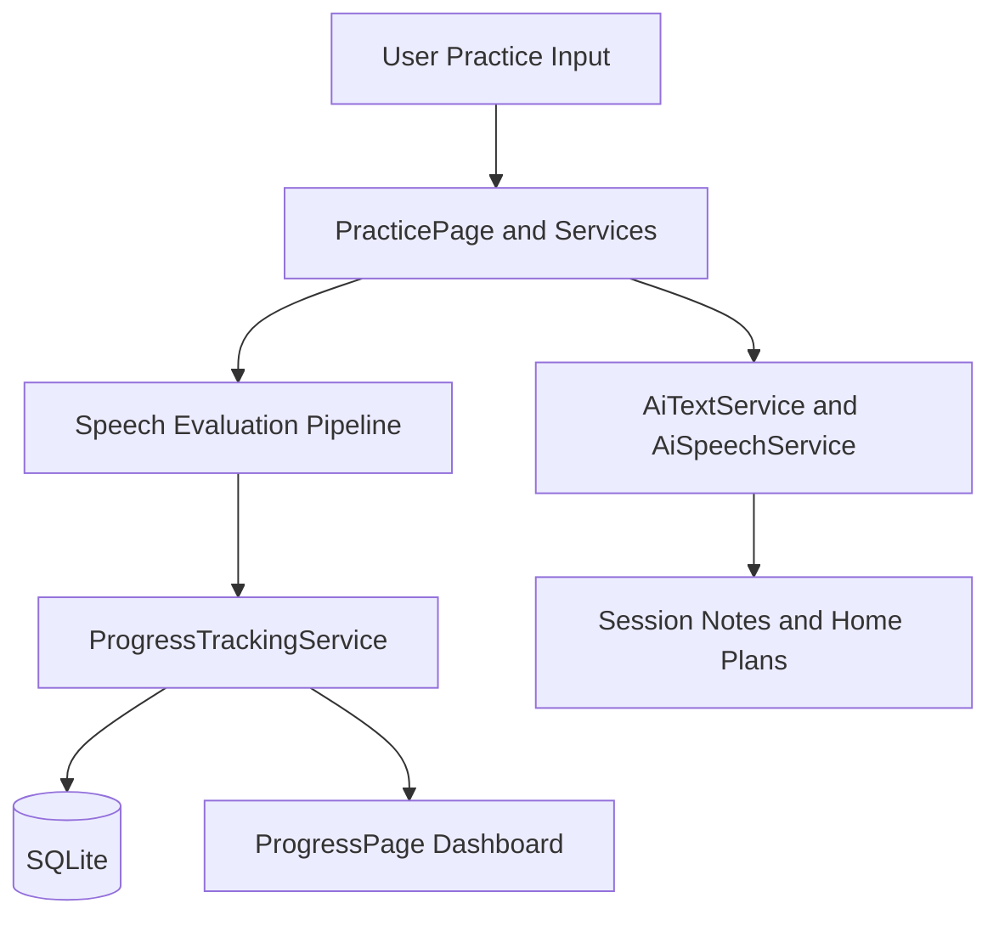
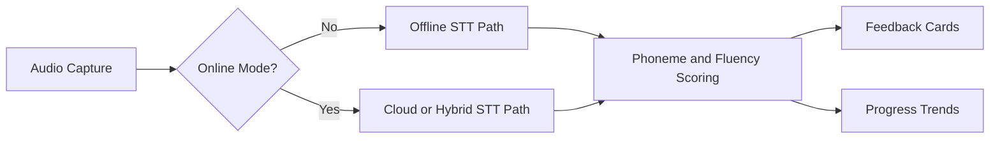
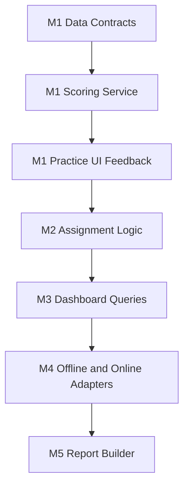
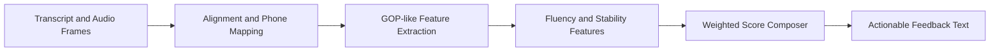
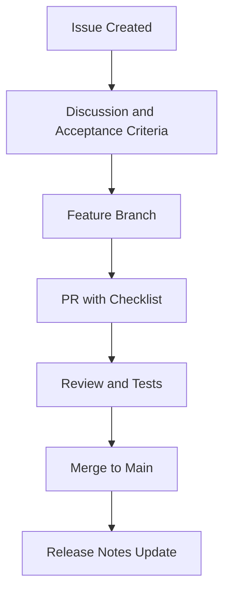

# SpeechBuddyAI


SpeechBuddyAI is a speech therapy companion focused on structured articulation practice, guided home assignments, and clinician-visible progress trends. The intent is to keep the app practical for real sessions, which means fast practice loops, understandable scores, and clean note workflows that reduce documentation time.

This README now serves as both a product roadmap and an implementation design brief. It explains what each subsystem does, why it exists, when to use each free library or API option, and how the scoring pipeline can evolve from baseline heuristics to more research-grounded pronunciation assessment.

> [!IMPORTANT]
> This project is educational and support-oriented software, not a medical device. Outputs are meant to assist clinicians and families, not replace licensed clinical judgment.

## Table of Contents

1. Vision and Scope
2. Top-Level Comparison Guide
3. Tech Stack and Why It Was Chosen
4. Architecture Overview
5. Roadmap Continuation
6. Algorithms and Formulas
7. Free Libraries and Public APIs
8. Collapsible API Reference
9. GitHub-Inspired Project Operations
10. Research and Citations
11. Local Setup and Build

## Vision and Scope

SpeechBuddyAI is designed around one central workflow: a learner attempts a target sound or phrase, the system evaluates performance, then the app immediately proposes a next best practice step. That tight loop is critical because speech practice quality depends on immediate and interpretable feedback.

A second design goal is traceability. Every score and recommendation should be explainable through component values like target phoneme match, fluency stability, and repetition trend. This is why the architecture uses explicit score components rather than a single opaque black-box label.

## Top-Level Comparison Guide

The following table is intentionally placed near the top so contributors can quickly decide which integration path to use for the next milestone.

| # | Option | Best Use Case | When Not To Use | What Is Different |
| --- | --- | --- | --- | --- |
| 1 | <sub>Offline-first STT (Vosk / whisper.cpp)</sub> | <sub>Privacy-sensitive clinics, unreliable network, on-device feedback loops</sub> | <sub>When you need cloud diarization or managed scaling immediately</sub> | <sub>Audio never has to leave device, deterministic local runtime cost</sub> |
| 2 | <sub>Cloud STT API</sub> | <sub>Rapid prototyping and broad language support with minimal local setup</sub> | <sub>Strict offline requirements, low-latency edge-only workflows</sub> | <sub>Fast to ship, but incurs network and data governance overhead</sub> |
| 3 | <sub>Hybrid STT (local primary, cloud fallback)</sub> | <sub>Production apps that need resilience and graceful degradation</sub> | <sub>Very small projects where dual pipelines are too complex</sub> | <sub>Best reliability profile but highest integration complexity</sub> |

> [!NOTE]
> This table helps select deployment posture first, before tuning models.

For pronunciation scoring strategy, use this quick matrix.

| # | Scoring Strategy | Use When | Avoid When | Why It Matters |
| --- | --- | --- | --- | --- |
| 1 | <sub>Rule-based baseline</sub> | <sub>Early MVP and transparent debugging</sub> | <sub>You need strong phoneme-level diagnostics at scale</sub> | <sub>Simple, interpretable, low compute cost</sub> |
| 2 | <sub>GOP-style phoneme scoring</sub> | <sub>Need per-phoneme feedback and targeted correction drills</sub> | <sub>No reliable canonical phone sequence is available</sub> | <sub>Aligns to CAPT literature and clinician explainability needs</sub> |
| 3 | <sub>Joint CAPT models (APA + MDD)</sub> | <sub>Research-grade system with annotated corpora and eval pipeline</sub> | <sub>Small team without dataset and MLOps bandwidth</sub> | <sub>Higher potential accuracy with greater implementation burden</sub> |

> [!TIP]
> Start with rule-based scoring for product flow validation, then add GOP-like detail, then test joint models only after your annotation and evaluation loop is stable.

## Tech Stack and Why It Was Chosen

SpeechBuddyAI currently uses a pragmatic stack that optimizes for cross-platform reach and iteration speed:

| # | Layer | Current Choice | Why This Choice | Alternative Considered |
| --- | --- | --- | --- | --- |
| 1 | <sub>App shell</sub> | <sub>.NET MAUI</sub> | <sub>One C# codebase across Android, iOS, desktop targets</sub> | <sub>Flutter, React Native, Electron</sub> |
| 2 | <sub>UI</sub> | <sub>XAML pages and shell navigation</sub> | <sub>Strong MAUI integration and maintainable view composition</sub> | <sub>Pure code-behind UI composition</sub> |
| 3 | <sub>Local data</sub> | <sub>SQLite</sub> | <sub>Simple offline persistence for notes, scores, and plans</sub> | <sub>Realm, LiteDB, cloud-first DBs</sub> |
| 4 | <sub>AI service abstraction</sub> | <sub>Service classes in Services/</sub> | <sub>Keeps provider changes isolated from page logic</sub> | <sub>Direct provider calls from pages</sub> |

> [!NOTE]
> The technical direction favors architecture that is understandable by small teams, including clinicians who may later contribute to requirements and validation.

## Architecture Overview

SpeechBuddyAI is organized to separate UI concerns from therapy logic and from provider-specific AI adapters. This keeps future migration work manageable, especially when swapping STT/TTS providers.



> [!NOTE]
> This diagram shows the central learning loop where every attempt becomes both immediate feedback and long-term trend data.

The current project layout maps cleanly to that loop:

| # | Folder or File Area | Primary Responsibility | Data In | Data Out |
| --- | --- | --- | --- | --- |
| 1 | <sub>Pages/</sub> | <sub>UI workflows for practice, notes, progress, home</sub> | <sub>User taps, mic actions, selections</sub> | <sub>View model state and service requests</sub> |
| 2 | <sub>Services/</sub> | <sub>AI calls, score orchestration, persistence triggers</sub> | <sub>Transcripts, audio features, note content</sub> | <sub>Scores, summaries, suggested exercises</sub> |
| 3 | <sub>Models/</sub> | <sub>Domain entities like ProgressEntry and SessionNote</sub> | <sub>Structured app data</sub> | <sub>Serializable records</sub> |
| 4 | <sub>Database/</sub> | <sub>Local storage plumbing</sub> | <sub>Model records</sub> | <sub>Queryable historical data</sub> |

> [!TIP]
> Keep business rules in services, not in pages, so therapy logic remains testable.

The runtime architecture also includes optional online/offline switching.



> [!NOTE]
> This decision point allows the same UI to work in clinic, home, and low-connectivity contexts.

## Roadmap Continuation

The roadmap below continues from the current scaffold and turns it into a complete therapy workflow product.

| # | Milestone | Scope | Why Needed | Exit Criteria |
| --- | --- | --- | --- | --- |
| 1 | <sub>M1 - Baseline Practice Loop</sub> | <sub>Record attempt, score, store, show feedback card</sub> | <sub>Core therapeutic interaction</sub> | <sub>User can complete one full attempt-feedback-save cycle</sub> |
| 2 | <sub>M2 - Home Assignment Generator</sub> | <sub>Template-based plans from weak phonemes and session notes</sub> | <sub>Carryover outside clinic sessions</sub> | <sub>Exportable weekly plan appears with rationale</sub> |
| 3 | <sub>M3 - Longitudinal Dashboard</sub> | <sub>Session-over-session trend lines and streaks</sub> | <sub>Therapy decisions need trajectory, not snapshots</sub> | <sub>Trends visible for phoneme-level and session-level metrics</sub> |
| 4 | <sub>M4 - Hybrid Speech Pipeline</sub> | <sub>Offline-first STT with cloud fallback</sub> | <sub>Reliability and privacy balance</sub> | <sub>Seamless fallback with no UI breakage</sub> |
| 5 | <sub>M5 - Clinician Notes and Reports</sub> | <sub>SOAP-style summaries plus parent-friendly language</sub> | <sub>Documentation and communication efficiency</sub> | <sub>One-click report generation with editable sections</sub> |

> [!IMPORTANT]
> Milestones are ordered to validate clinical utility before model sophistication.

Implementation sequence for the next coding passes:



> [!NOTE]
> This is a dependency-safe ordering, minimizing rework while increasing product value at each step.

## Algorithms and Formulas

SpeechBuddyAI uses weighted composite scoring so feedback remains interpretable. A simple initial form:

$$
S_{overall} = w_p S_{phoneme} + w_f S_{fluency} + w_c S_{consistency}
$$

with constraints:

$$
w_p + w_f + w_c = 1, \quad 0 \leq w_i \leq 1
$$

This is preferred over a single opaque confidence score because therapists can tell the learner exactly which dimension to improve.

For target-word pronunciation confidence, a GOP-inspired measure can be approximated as log-posterior contrast:

$$
GOP(p) = \frac{1}{T_p} \sum_{t \in p} \log P(p \mid o_t) - \max_{q \neq p} \frac{1}{T_p} \sum_{t \in p} \log P(q \mid o_t)
$$

where $p$ is target phoneme, $o_t$ are frame-level acoustic observations, and $T_p$ is aligned frame count.

For home practice scheduling, a forgetting-curve-aware interval update can start with:

$$
I_{n+1} = I_n \cdot (1 + \alpha \cdot R_n - \beta \cdot E_n)
$$

where $R_n$ is recent retention proxy and $E_n$ is weighted error rate.

| # | Algorithm | Purpose | Chosen Instead Of | Why This Choice |
| --- | --- | --- | --- | --- |
| 1 | <sub>Weighted composite score</sub> | <sub>Readable session feedback</sub> | <sub>Single latent confidence output</sub> | <sub>High interpretability and tunable behavior</sub> |
| 2 | <sub>GOP-like phoneme contrast</sub> | <sub>Phone-level correction hints</sub> | <sub>Word-only correctness labels</sub> | <sub>Supports targeted drills and minimal pairs</sub> |
| 3 | <sub>Adaptive interval update</sub> | <sub>Home practice timing</sub> | <sub>Fixed daily repetition schedule</sub> | <sub>Balances burden and retention</sub> |

> [!NOTE]
> Formula complexity should increase only after baseline explainability is validated with clinicians.

The score pipeline can be represented as follows:



> [!TIP]
> Keep intermediate features stored for auditability and future model retraining.

## Free Libraries and Public APIs

The following options are prioritized because they are free/open and practical for incremental integration in a .NET MAUI codebase.

| # | Library or API | Category | License or Access Model | Why Relevant to SpeechBuddyAI |
| --- | --- | --- | --- | --- |
| 1 | <sub>Vosk</sub> | <sub>Offline STT</sub> | <sub>Apache-2.0</sub> | <sub>On-device recognition and streaming support across many languages</sub> |
| 2 | <sub>whisper.cpp</sub> | <sub>Offline STT</sub> | <sub>MIT</sub> | <sub>High-performance local inference with broad platform support and .NET bindings ecosystem</sub> |
| 3 | <sub>CMUdict</sub> | <sub>Pronunciation lexicon</sub> | <sub>Free unrestricted use notice</sub> | <sub>Canonical phoneme targets for scoring and minimal pair generation</sub> |
| 4 | <sub>Datamuse API</sub> | <sub>Word suggestion API</sub> | <sub>Public free tier with daily limit policy</sub> | <sub>Generate related words and topic-constrained practice content</sub> |

> [!IMPORTANT]
> Datamuse currently documents free use with daily request limits and upcoming API key requirements timeline. Treat this as dependency risk and add local caching.

Ideas adapted from relevant GitHub projects:

| # | Source Project | Borrowed Idea | How To Apply In SpeechBuddyAI | Priority |
| --- | --- | --- | --- | --- |
| 1 | <sub>fulldecent/vowel-practice</sub> | <sub>Formant and vowel-focused practice workflows</sub> | <sub>Add optional vowel mode with simple visual target zones</sub> | <sub>Medium</sub> |
| 2 | <sub>assinscreedFC/ortholyse</sub> | <sub>Offline transcription plus clinician metrics pipeline</sub> | <sub>Strengthen local-first data flow and report generation</sub> | <sub>High</sub> |
| 3 | <sub>KorayUlusan/delayed-auditory-feedback-online</sub> | <sub>DAF therapeutic audio feature</sub> | <sub>Add experimental delayed feedback mode for fluency practice</sub> | <sub>Medium</sub> |
| 4 | <sub>speech-therapy topic repositories</sub> | <sub>Accessibility-first interaction patterns</sub> | <sub>Improve large controls, guided flows, and family mode UX</sub> | <sub>High</sub> |

> [!NOTE]
> These ideas are architectural inspirations, not code imports.

## Collapsible API Reference

<details>
<summary><strong>SpeechBuddyAI planned service contracts (expand)</strong></summary>

### Speech Assessment API

| # | Endpoint | Method | Input | Output |
| --- | --- | --- | --- | --- |
| 1 | <sub>/api/speech/transcribe</sub> | <sub>POST</sub> | <sub>Audio payload or file reference</sub> | <sub>Transcript with token timings</sub> |
| 2 | <sub>/api/speech/score</sub> | <sub>POST</sub> | <sub>Transcript, target text, optional phoneme map</sub> | <sub>Composite score, phone diagnostics, confidence bands</sub> |
| 3 | <sub>/api/speech/recommend</sub> | <sub>POST</sub> | <sub>Recent weak phonemes and session context</sub> | <sub>Ranked drills and target word list</sub> |

> [!TIP]
> Keep all outputs versioned so future model upgrades do not break historical sessions.

### Session Notes API

| # | Endpoint | Method | Input | Output |
| --- | --- | --- | --- | --- |
| 1 | <sub>/api/notes/summarize</sub> | <sub>POST</sub> | <sub>Clinician free-text notes and session metadata</sub> | <sub>SOAP draft and parent-facing summary</sub> |
| 2 | <sub>/api/notes/export</sub> | <sub>POST</sub> | <sub>Session id and export format</sub> | <sub>Printable report artifact</sub> |

> [!NOTE]
> Summary generation should always allow clinician edit before finalization.

</details>

## GitHub-Inspired Project Operations

Use GitHub-native patterns so roadmap execution is visible and contributor-friendly.



> [!NOTE]
> This keeps roadmap tasks measurable and reviewable, especially for clinician-facing features.

Recommended issue labels and usage:

| # | Label | Purpose | Example Ticket | Merge Gate |
| --- | --- | --- | --- | --- |
| 1 | <sub>therapy-core</sub> | <sub>Practice loop and scoring logic</sub> | <sub>Phoneme-level feedback card redesign</sub> | <sub>Manual QA plus unit tests</sub> |
| 2 | <sub>ai-integration</sub> | <sub>Model/provider adapters and prompts</sub> | <sub>Add offline Vosk adapter</sub> | <sub>Contract tests and fallback checks</sub> |
| 3 | <sub>privacy-and-safety</sub> | <sub>Data handling and consent features</sub> | <sub>Session export redaction options</sub> | <sub>Security review</sub> |
| 4 | <sub>research-sync</sub> | <sub>Papers, benchmarks, evaluation method updates</sub> | <sub>GOP-SF experiment notes</sub> | <sub>Reproducibility checklist</sub> |

> [!IMPORTANT]
> Every roadmap item should include clinical rationale, not only technical acceptance criteria.

## Research and Citations

This section tracks references used for architecture and algorithm selection so decisions remain auditable.

### Foundational CAPT and Pronunciation Assessment

1. Korzekwa et al. - Computer-assisted Pronunciation Training - Speech synthesis is almost all you need, arXiv:2207.00774, DOI: 10.48550/arXiv.2207.00774
2. Yang et al. - JCAPT: A Joint Modeling Approach for CAPT, arXiv:2506.19315, DOI: 10.48550/arXiv.2506.19315
3. Cao et al. - Segmentation-free Goodness of Pronunciation, arXiv:2507.16838, DOI: 10.48550/arXiv.2507.16838
4. Zhang et al. - speechocean762 corpus, arXiv:2104.01378, DOI: 10.48550/arXiv.2104.01378
5. Sudhakara et al. - Improved GoP with DNN-HMM and transition probabilities, INTERSPEECH 2019

### Open Projects and API Docs Consulted

1. Vosk toolkit repository and docs
2. whisper.cpp repository and docs
3. Coqui TTS repository
4. CMUdict repository
5. Datamuse API documentation
6. GitHub speech-therapy topic ecosystem and project examples

> [!TIP]
> Keep this section current as new roadmap phases are implemented. It helps new contributors understand why specific methods were selected.

## Local Setup and Build

The current repository is a MAUI scaffold with domain structure prepared for feature implementation.

### Prerequisites

1. .NET SDK compatible with MAUI target version
2. MAUI workload installed
3. Platform SDKs as needed (Android/iOS/desktop)

### Build

```bash
dotnet restore
dotnet build
```

### Immediate Next Coding Tasks

1. Implement score component model in services and persist component-level telemetry.
2. Add offline speech adapter interface with an initial local provider implementation.
3. Add first dashboard chart page using stored longitudinal score components.
4. Add report generation baseline for clinician notes and parent summary.

> [!IMPORTANT]
> Prioritize reliable data contracts and offline persistence first, then model quality improvements.

