# SpeechBuddyAI


SpeechBuddyAI is a speech therapy companion focused on practical articulation workflows, transparent score components, and session-to-session progress tracking that can be reviewed by clinicians and families. The project is intentionally designed to avoid black-box behavior in early milestones, because trust and interpretability are central in speech practice tools.

This README is both a product guide and a technical implementation reference. It explains what the app does, why each subsystem exists, how scoring is computed, what tradeoffs were chosen, and which free public libraries or APIs are realistic for future expansion.

> [!IMPORTANT]
> SpeechBuddyAI is support software and is not a medical device. The outputs should assist therapy planning, not replace professional clinical decision-making.

## Table of Contents

1. What This Project Does
2. Fast Comparison Tables (Use/Do Not Use)
3. Current Milestone Status
4. Tech Stack and Architecture
5. Algorithms and Formulas
6. Public Libraries and API Strategy
7. Collapsible API Reference
8. GitHub Workflow and Tracking
9. Research Citations
10. Operations and Reliability Playbook
11. Build, Run, and Practical Notes

## What This Project Does

SpeechBuddyAI supports a feedback loop where a learner practices a target sound, receives component-level scoring feedback, and stores attempts for trend review. In the current M1 implementation, the focus is not on maximizing model complexity, but on making the loop reliable and understandable.

The app currently demonstrates a complete vertical slice for M1. A user can enter a target sound and transcript, run scoring, see phoneme/fluency/consistency components, and persist the attempt. That same data appears in the progress dashboard so the practice loop produces longitudinal records instead of one-off scores.

> [!NOTE]
> Persistence now uses app-local SQLite. Baseline roadmap features through M5 are implemented, including trend analysis, assignment generation, fallback scoring adapters, and report generation.

## Reader-Level Guide (6 out of 10)

This README is written at a medium technical level. That means you do not need to be a speech-AI researcher to follow it, but you should expect practical engineering terms such as calibration, confidence intervals, schema migrations, and weighted scoring contracts. The goal is to explain the system in a way that helps clinicians, product contributors, and developers make good decisions together.

At this level, we focus on three questions in each section: what the subsystem does, why it is needed in the therapy workflow, and what tradeoff was accepted to keep the implementation stable. This is important because speech-therapy software fails when either side is missing: if it is only technical, clinicians cannot trust it, and if it is only plain-language, developers cannot maintain it safely.

| <sub>#</sub> | <sub>Read This If You Are...</sub> | <sub>What You Will Learn</sub> | <sub>Skip If</sub> |
| --- | --- | --- | --- |
| <sub>1</sub> | <sub>Clinician with technical curiosity</sub> | <sub>How confidence, calibration, and score components map to therapy decisions</sub> | <sub>You only need day-to-day usage instructions</sub> |
| <sub>2</sub> | <sub>Engineer onboarding to project</sub> | <sub>Architecture contracts, data flow, and why current formulas were chosen</sub> | <sub>You already worked on M1 through M7 internals</sub> |
| <sub>3</sub> | <sub>Reviewer or collaborator</sub> | <sub>How roadmap features tie to auditability and reproducibility</sub> | <sub>You are only reviewing UI styling changes</sub> |

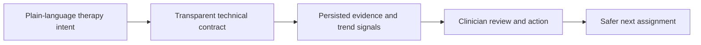
```mermaid
flowchart LR
  A[Plain-language therapy intent] --> B[Transparent technical contract]
  B --> C[Persisted evidence and trend signals]
  C --> D[Clinician review and action]
  D --> E[Safer next assignment]
```

> [!TIP]
> If you are new to the codebase, read sections in this order: What This Project Does, Fast Comparison Tables, Tech Stack and Architecture, then Algorithms and Formulas.

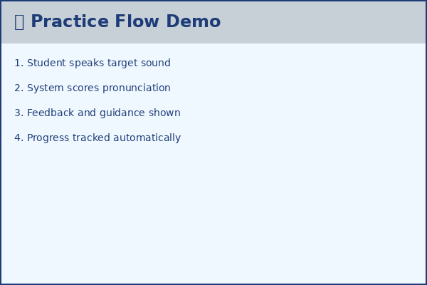

### Practice Loop in Action

The Practice page is where the core feedback loop begins. A learner enters a target phoneme and transcript, presses the "Score Attempt" button, and immediately receives component-level scoring feedback. This visual shows the practice interface with real-time feedback on phoneme accuracy, fluency stability, and consistency patterns. Each attempt captures phoneme, fluency, consistency, and overall scores, which are then persisted for longitudinal tracking.

The transparent component breakdown helps learners and clinicians understand exactly what drove the score rather than seeing a single opaque number. If a child struggles with fluency on one attempt but nails phoneme accuracy, that distinction becomes actionable coaching feedback. Over time, this granular data accumulates in the SQLite store and feeds into the Progress dashboard and clinician reports.

## Fast Comparison Tables (Use/Do Not Use)

These tables are intentionally near the top so new contributors can quickly pick the right technical direction before coding.

### Top-Level Build and Runtime Decisions

| <sub>#</sub> | <sub>Decision Area</sub> | <sub>Option A</sub> | <sub>Option B</sub> | <sub>When A Wins</sub> | <sub>When B Wins</sub> |
| --- | --- | --- | --- | --- | --- |
| <sub>1</sub> | <sub>UI architecture</sub> | <sub>Page code-behind plus service calls</sub> | <sub>Strict MVVM with heavy abstraction</sub> | <sub>Fast milestone delivery with explicit logic tracing</sub> | <sub>Large team with strict view-model discipline</sub> |
| <sub>2</sub> | <sub>Storage model</sub> | <sub>Local SQLite single-user</sub> | <sub>Remote synchronized datastore</sub> | <sub>Offline-first therapy sessions and lower operational complexity</sub> | <sub>Cross-device collaboration is mandatory</sub> |
| <sub>3</sub> | <sub>Scoring style</sub> | <sub>Transparent weighted components</sub> | <sub>End-to-end opaque model output</sub> | <sub>Interpretability and safe tuning are required</sub> | <sub>High-volume labeled data and explainability budget exist</sub> |
| <sub>4</sub> | <sub>Assignment adaptation</sub> | <sub>Heuristic with guardrails</sub> | <sub>Fully automated policy update</sub> | <sub>Clinical oversight is required for every adjustment</sub> | <sub>Regulated automation and robust governance already in place</sub> |

| <sub>#</sub> | <sub>Runtime Stage</sub> | <sub>What Happens</sub> | <sub>Why It Is Needed</sub> | <sub>Failure Risk if Missing</sub> |
| --- | --- | --- | --- | --- |
| <sub>1</sub> | <sub>Input normalization</sub> | <sub>Target and transcript are cleaned and standardized</sub> | <sub>Prevents false variance from trivial formatting differences</sub> | <sub>Inconsistent scores for semantically identical attempts</sub> |
| <sub>2</sub> | <sub>Historical lookup</sub> | <sub>Recent attempts are loaded per target</sub> | <sub>Supports trend-aware consistency and confidence logic</sub> | <sub>Scores lose temporal context and become noisy</sub> |
| <sub>3</sub> | <sub>Scoring calculation</sub> | <sub>Phoneme, fluency, consistency, and overall are computed</sub> | <sub>Produces interpretable dimensions, not just one scalar</sub> | <sub>Clinicians cannot diagnose what changed</sub> |
| <sub>4</sub> | <sub>Persistence and audit tagging</sub> | <sub>Result is saved with versioning and metadata</sub> | <sub>Enables historical comparability across model updates</sub> | <sub>Cannot explain differences between older and newer outputs</sub> |

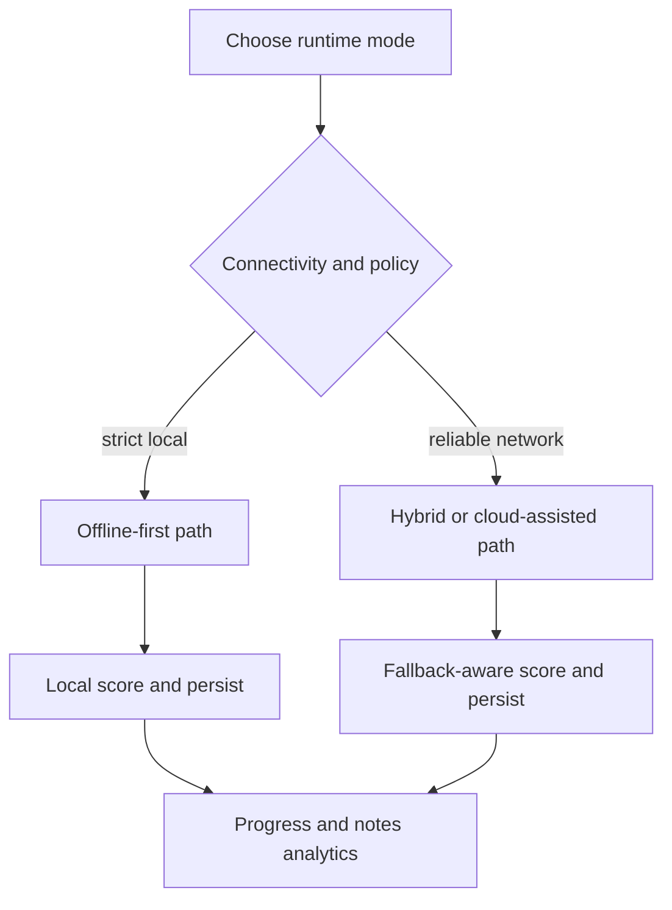
```mermaid
flowchart TD
  A[Choose runtime mode] --> B{Connectivity and policy}
  B -->|strict local| C[Offline-first path]
  B -->|reliable network| D[Hybrid or cloud-assisted path]
  C --> E[Local score and persist]
  D --> F[Fallback-aware score and persist]
  E --> G[Progress and notes analytics]
  F --> G
```

### Deployment and Inference Modes

| <sub>#</sub> | <sub>Option</sub> | <sub>What It Does</sub> | <sub>Use When</sub> |
| --- | --- | --- | --- |
| <sub>1</sub> | <sub>Offline-first STT</sub> | <sub>Runs recognition on device without cloud audio upload</sub> | <sub>Privacy-sensitive workflows and poor connectivity</sub> |
| <sub>2</sub> | <sub>Cloud STT</sub> | <sub>Delegates recognition to hosted API</sub> | <sub>Rapid iteration and broad language support</sub> |
| <sub>3</sub> | <sub>Hybrid STT</sub> | <sub>Uses local path first and cloud fallback</sub> | <sub>Production resilience in mixed network conditions</sub> |

| <sub>#</sub> | <sub>Option</sub> | <sub>Do Not Use When</sub> | <sub>How It Works</sub> |
| --- | --- | --- | --- |
| <sub>1</sub> | <sub>Offline-first STT</sub> | <sub>Managed cloud diarization is required immediately</sub> | <sub>Capture audio to local model to score pipeline</sub> |
| <sub>2</sub> | <sub>Cloud STT</sub> | <sub>Strict local-only policy or high latency constraints</sub> | <sub>Capture audio to upload to transcript to score</sub> |
| <sub>3</sub> | <sub>Hybrid STT</sub> | <sub>Team cannot maintain two adapters yet</sub> | <sub>Try local, fallback to cloud, continue scoring</sub> |

> [!TIP]
> For this codebase, hybrid is the long-term target, but offline-first should remain the default experience.

### Scoring Strategy Comparison

| <sub>#</sub> | <sub>Strategy</sub> | <sub>What It Measures</sub> | <sub>Best For</sub> |
| --- | --- | --- | --- |
| <sub>1</sub> | <sub>Rule-based component scoring</sub> | <sub>Phoneme match proxy, fluency proxy, consistency proxy</sub> | <sub>MVP reliability and explainability</sub> |
| <sub>2</sub> | <sub>GOP-style scoring</sub> | <sub>Phoneme-level posterior contrast confidence</sub> | <sub>Targeted phone-level coaching and minimal pairs</sub> |
| <sub>3</sub> | <sub>Joint APA plus MDD models</sub> | <sub>Pronunciation quality plus error diagnosis</sub> | <sub>Research-grade CAPT with curated datasets</sub> |

| <sub>#</sub> | <sub>Strategy</sub> | <sub>Not Ideal For</sub> | <sub>Why Chosen or Deferred</sub> |
| --- | --- | --- | --- |
| <sub>1</sub> | <sub>Rule-based component scoring</sub> | <sub>Fine-grained phonetic diagnostics at scale</sub> | <sub>Chosen for M1 due transparency and low complexity</sub> |
| <sub>2</sub> | <sub>GOP-style scoring</sub> | <sub>Pipelines without phoneme alignment and lexicon</sub> | <sub>Planned as M2 and M3 enhancement</sub> |
| <sub>3</sub> | <sub>Joint APA plus MDD models</sub> | <sub>Small teams without ML ops and annotation capacity</sub> | <sub>Deferred due complexity and data requirements</sub> |

### Persistence Backends Comparison

| <sub>#</sub> | <sub>Backend</sub> | <sub>What It Does</sub> | <sub>Use When</sub> |
| --- | --- | --- | --- |
| <sub>1</sub> | <sub>JSON file store current M1</sub> | <sub>Simple local persistence with low setup overhead</sub> | <sub>Early milestone and local prototype workflows</sub> |
| <sub>2</sub> | <sub>SQLite planned</sub> | <sub>Relational local database with indexed queries</sub> | <sub>Dashboard analytics and larger history datasets</sub> |
| <sub>3</sub> | <sub>Cloud sync DB</sub> | <sub>Cross-device shared history and backup</sub> | <sub>Multi-device clinician-family workflows</sub> |

| <sub>#</sub> | <sub>Backend</sub> | <sub>Avoid When</sub> | <sub>Migration Notes</sub> |
| --- | --- | --- | --- |
| <sub>1</sub> | <sub>JSON file store current M1</sub> | <sub>Robust query and reporting at scale is required</sub> | <sub>Current implementation in ProgressTrackingService</sub> |
| <sub>2</sub> | <sub>SQLite planned</sub> | <sub>Ultra-light demos without query complexity</sub> | <sub>Planned migration path for M2 or M3</sub> |
| <sub>3</sub> | <sub>Cloud sync DB</sub> | <sub>Offline-only deployments</sub> | <sub>Add after local model and privacy policy stabilize</sub> |

> [!IMPORTANT]
> Keep README claims aligned with code reality. Runtime persistence is SQLite-based, including schema-safe column migration at service initialization.

### Step-by-Step Flow Comparison

| <sub>#</sub> | <sub>Flow</sub> | <sub>Step 1</sub> | <sub>Step 2</sub> | <sub>Step 3</sub> | <sub>Step 4</sub> |
| --- | --- | --- | --- | --- | --- |
| <sub>1</sub> | <sub>Practice scoring flow</sub> | <sub>Collect target and transcript</sub> | <sub>Compute component scores</sub> | <sub>Apply confidence and guardrail logic</sub> | <sub>Persist and display immediately</sub> |
| <sub>2</sub> | <sub>Assignment generation flow</sub> | <sub>Aggregate weak-pattern history</sub> | <sub>Rank focus targets with evidence weighting</sub> | <sub>Attach rationale, confidence, and suppression flags</sub> | <sub>Persist snapshot with formula version</sub> |
| <sub>3</sub> | <sub>Model audit flow</sub> | <sub>Load snapshot history</sub> | <sub>Compute calibration and drift summaries</sub> | <sub>Render longitudinal trend strips in Notes</sub> | <sub>Support clinician review before adjustments</sub> |

| <sub>#</sub> | <sub>Guardrail</sub> | <sub>Purpose</sub> | <sub>Trigger</sub> | <sub>Effect</sub> |
| --- | --- | --- | --- | --- |
| <sub>1</sub> | <sub>Minimum sample threshold for CI</sub> | <sub>Avoid overstating confidence with sparse evidence</sub> | <sub>Too few observations for target</sub> | <sub>Suppress confidence interval display</sub> |
| <sub>2</sub> | <sub>Minimum history depth for suggestions</sub> | <sub>Prevent unstable policy recommendations</sub> | <sub>Insufficient snapshot history</sub> | <sub>No weight-shift recommendation issued</sub> |
| <sub>3</sub> | <sub>Per-update delta cap</sub> | <sub>Limit abrupt strategy changes</sub> | <sub>Proposed shift exceeds bounded delta</sub> | <sub>Clamp to safe maximum adjustment</sub> |
| <sub>4</sub> | <sub>Clinician approval requirement</sub> | <sub>Keep human control over adaptation</sub> | <sub>Any advisory suggestion produced</sub> | <sub>No automatic write-back of weights</sub> |

## Current Milestone Status

M1 is now implemented as an end-to-end slice. It captures practice attempts, computes score components, saves each attempt, and renders persisted entries in the progress view.

| <sub>#</sub> | <sub>M1 Contract Item</sub> | <sub>Status</sub> | <sub>Implementation Detail</sub> |
| --- | --- | --- | --- |
| <sub>1</sub> | <sub>Practice input capture</sub> | <sub>Done</sub> | <sub>Target and transcript entered on Practice page</sub> |
| <sub>2</sub> | <sub>Component scoring loop</sub> | <sub>Done</sub> | <sub>Phoneme, fluency, consistency, and overall computed</sub> |
| <sub>3</sub> | <sub>Persisted score components</sub> | <sub>Done</sub> | <sub>ProgressEntry includes components and transcript</sub> |
| <sub>4</sub> | <sub>Longitudinal attempt list</sub> | <sub>Done</sub> | <sub>Progress page loads persisted entries</sub> |
| <sub>5</sub> | <sub>Error pattern tag</sub> | <sub>Done</sub> | <sub>Simple pattern inference for categorization</sub> |

### M1 Runtime Loop

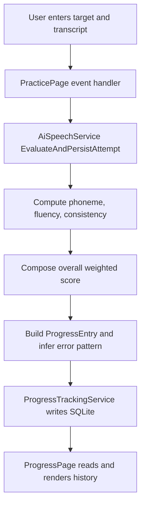
```mermaid
flowchart TD
    A[User enters target and transcript] --> B[PracticePage event handler]
    B --> C[AiSpeechService EvaluateAndPersistAttempt]
    C --> D[Compute phoneme, fluency, consistency]
    D --> E[Compose overall weighted score]
    E --> F[Build ProgressEntry and infer error pattern]
    F --> G[ProgressTrackingService writes SQLite]
    G --> H[ProgressPage reads and renders history]
```

> [!NOTE]
> This flow is intentionally deterministic and transparent, making it suitable for milestone validation and debugging.

### M1 Sequence by Component

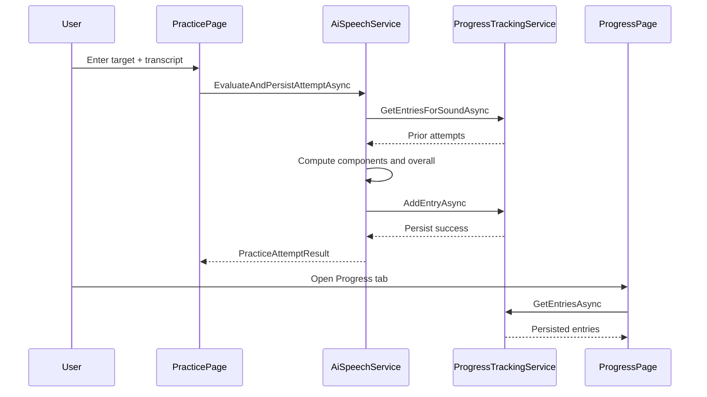
```mermaid
sequenceDiagram
    participant U as User
    participant P as PracticePage
    participant S as AiSpeechService
    participant T as ProgressTrackingService
    participant R as ProgressPage
    U->>P: Enter target + transcript
    P->>S: EvaluateAndPersistAttemptAsync
    S->>T: GetEntriesForSoundAsync
    T-->>S: Prior attempts
    S->>S: Compute components and overall
    S->>T: AddEntryAsync
    T-->>S: Persist success
    S-->>P: PracticeAttemptResult
    U->>R: Open Progress tab
    R->>T: GetEntriesAsync
    T-->>R: Persisted entries
```

### M1 Data Shape (Score Components)

| <sub>#</sub> | <sub>Field</sub> | <sub>Meaning</sub> | <sub>Range</sub> | <sub>Why Needed</sub> |
| --- | --- | --- | --- | --- |
| <sub>1</sub> | <sub>PhonemeScore</sub> | <sub>Target match proxy</sub> | <sub>0.0 to 1.0</sub> | <sub>Core articulation confidence dimension</sub> |
| <sub>2</sub> | <sub>FluencyScore</sub> | <sub>Stability and length proxy</sub> | <sub>0.0 to 1.0</sub> | <sub>Captures rhythm and continuity signal</sub> |
| <sub>3</sub> | <sub>ConsistencyScore</sub> | <sub>Variation across recent attempts</sub> | <sub>0.0 to 1.0</sub> | <sub>Distinguishes one-off success from stability</sub> |
| <sub>4</sub> | <sub>OverallScore</sub> | <sub>Weighted aggregate score</sub> | <sub>0.0 to 1.0</sub> | <sub>Supports fast clinician and learner interpretation</sub> |

## Tech Stack and Architecture

SpeechBuddyAI uses .NET MAUI and C# to keep mobile and desktop targets in one codebase. This keeps early milestones fast to iterate, while still allowing clear separation between pages, services, and models.

The stack was chosen to optimize delivery risk, not just novelty. .NET MAUI gives one codebase for Android, iOS, Windows, and MacCatalyst, while SQLite provides an embedded store that works even during unreliable connectivity. For this project, that combination matters because therapy sessions should not fail when internet quality changes.

At a practical level, architecture clarity is treated as a safety feature. Every score the user sees should be traceable to formulas, input context, and data history. That is why service boundaries and snapshot versioning are first-class concerns in this codebase.

### Current vs Planned Stack

| <sub>#</sub> | <sub>Layer</sub> | <sub>Current Implemented</sub> | <sub>Planned Direction</sub> | <sub>Why This Matters</sub> |
| --- | --- | --- | --- | --- |
| <sub>1</sub> | <sub>UI Shell</sub> | <sub>.NET MAUI Shell with tab navigation</sub> | <sub>Same plus richer state and chart controls</sub> | <sub>Maintains cross-platform consistency</sub> |
| <sub>2</sub> | <sub>Scoring Service</sub> | <sub>AiSpeechService with transparent formulas</sub> | <sub>Adapter-friendly offline and online models</sub> | <sub>Model upgrades without UI rewrite</sub> |
| <sub>3</sub> | <sub>Persistence</sub> | <sub>SQLite app-local store</sub> | <sub>Schema-safe migrations and richer analytics</sub> | <sub>Enables deeper trend views and reporting</sub> |
| <sub>4</sub> | <sub>Practice Content</sub> | <sub>AiTextService generated words</sub> | <sub>Constraint-aware personalized assignments</sub> | <sub>Improves carryover and relevance</sub> |

> [!TIP]
> Preserve service boundaries now so later migration from JSON to SQLite and from heuristics to model-based scoring remains low-risk.

### Architecture View

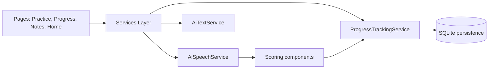
```mermaid
flowchart LR
    A[Pages: Practice, Progress, Notes, Home] --> B[Services Layer]
    B --> C[AiSpeechService]
    B --> D[AiTextService]
    B --> E[ProgressTrackingService]
    E --> F[(SQLite persistence)]
    C --> G[Scoring components]
    G --> E
```

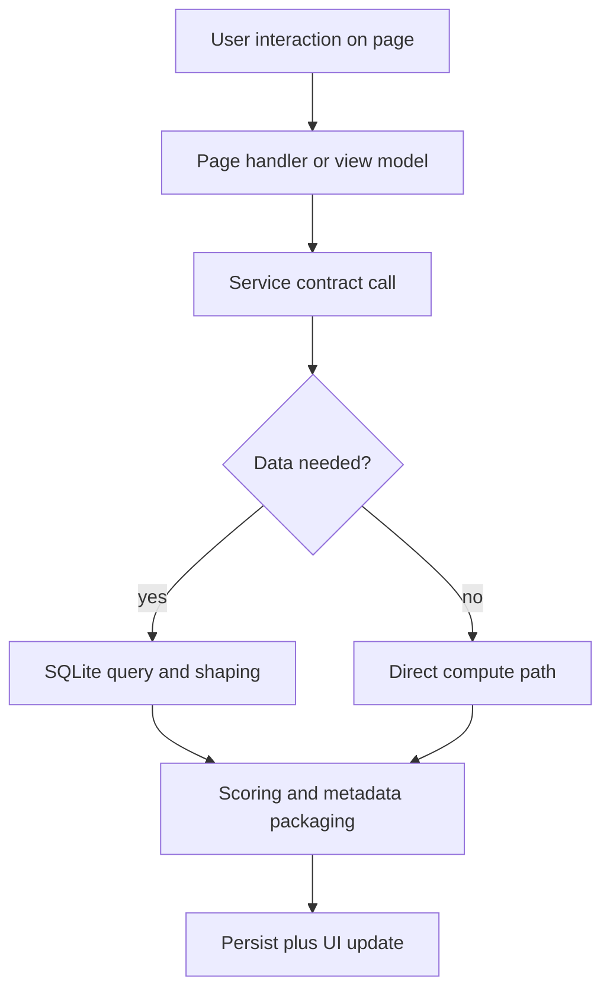
```mermaid
flowchart TD
    A[User interaction on page] --> B[Page handler or view model]
    B --> C[Service contract call]
    C --> D{Data needed?}
    D -->|yes| E[SQLite query and shaping]
    D -->|no| F[Direct compute path]
    E --> G[Scoring and metadata packaging]
    F --> G
    G --> H[Persist plus UI update]
```

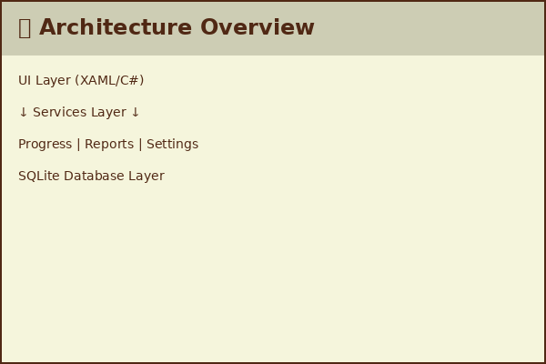

### Service Layer and Data Flow

The architecture isolates concern areas so that changes to scoring logic do not ripple into persistence or UI rendering. The AiSpeechService owns the scoring contract and component computation, while ProgressTrackingService manages all SQLite transactions. Pages bind to view models that call services, not directly to database calls. This separation enables safe A/B testing of scoring methods and schema migrations without breaking UI stability.

Each service is composed to be testable and replaceable. For example, if a new GOP-based scorer is added in M3, it can implement the same output contract as AiSpeechService and be swapped in without page rewrites. The same pattern applies to persistence: future migration to a cloud backend would require new ProgressTrackingService implementation but zero changes to page code or business logic.

### Data Lifecycle

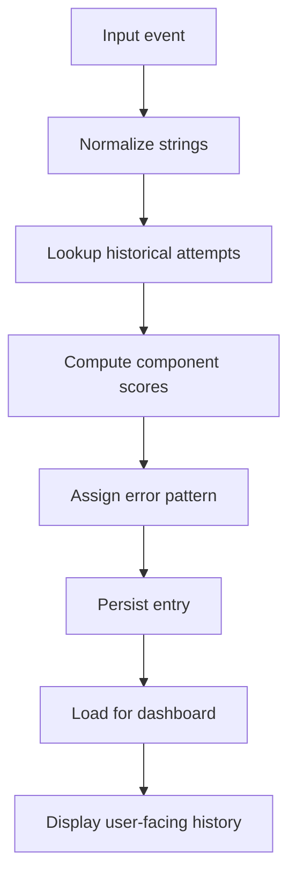
```mermaid
flowchart TD
    A[Input event] --> B[Normalize strings]
    B --> C[Lookup historical attempts]
    C --> D[Compute component scores]
    D --> E[Assign error pattern]
    E --> F[Persist entry]
    F --> G[Load for dashboard]
    G --> H[Display user-facing history]
```


```mermaid
flowchart LR
    A[Snapshot N] --> B[Formula version tag]
    B --> C[Confidence metadata]
    C --> D[Calibration horizon metrics]
    D --> E[Advisory suggestion artifact]
    E --> F[Notes audit rendering]
```

### Architecture Responsibility Matrix

| <sub>#</sub> | <sub>Layer</sub> | <sub>Primary Responsibility</sub> | <sub>What It Must Not Do</sub> | <sub>Why This Boundary Exists</sub> |
| --- | --- | --- | --- | --- |
| <sub>1</sub> | <sub>Pages</sub> | <sub>Capture user intent and render state</sub> | <sub>Embed SQL or scoring math directly</sub> | <sub>Keeps UI testable and stable during logic changes</sub> |
| <sub>2</sub> | <sub>AiSpeechService</sub> | <sub>Compute score components and confidence outputs</sub> | <sub>Hard-code page-specific presentation concerns</sub> | <sub>Supports scorer evolution without UI rewrites</sub> |
| <sub>3</sub> | <sub>AiTextService</sub> | <sub>Generate practice words and assignments with rationale</sub> | <sub>Mutate historical attempt records</sub> | <sub>Preserves clean separation between planning and evidence</sub> |
| <sub>4</sub> | <sub>ProgressTrackingService</sub> | <sub>Persist and query longitudinal data</sub> | <sub>Change scoring behavior based on UI state</sub> | <sub>Ensures historical consistency and reproducibility</sub> |
| <sub>5</sub> | <sub>ReportService</sub> | <sub>Assemble session and parent-facing exports</sub> | <sub>Recompute core scoring independently</sub> | <sub>Avoids drift between report and live dashboard values</sub> |

### Why This Architecture Was Chosen

The architecture favors readability and composability over early optimization. In speech therapy software, implementation clarity is a product feature because teams need to verify behavior and reason about edge cases with clinicians.

The same structure also makes A/B comparisons easier later. If you introduce a GOP-based scorer, you can keep the same output contract and compare old and new methods in parallel without destabilizing the pages.

## Algorithms and Formulas

The current M1 approach uses weighted component scoring instead of a single hidden confidence output. This is a deliberate choice for explainability and iterative calibration.

### Current M1 Formula

$$
S_{overall} = 0.60 S_{phoneme} + 0.25 S_{fluency} + 0.15 S_{consistency}
$$

Where each component is clamped to $[0,1]$ before aggregation.

### Why This Formula and Not a Single Black Box Score

| <sub>#</sub> | <sub>Option</sub> | <sub>Advantage</sub> | <sub>Limitation</sub> | <sub>Decision</sub> |
| --- | --- | --- | --- | --- |
| <sub>1</sub> | <sub>Single confidence score</sub> | <sub>Simple output</sub> | <sub>Low interpretability and difficult debugging</sub> | <sub>Not chosen for M1</sub> |
| <sub>2</sub> | <sub>Weighted components current</sub> | <sub>Transparent and tunable</sub> | <sub>Not yet full phonetic rigor</sub> | <sub>Chosen for M1</sub> |
| <sub>3</sub> | <sub>Learned end-to-end score</sub> | <sub>Potentially higher accuracy</sub> | <sub>Data and explainability burden</sub> | <sub>Deferred to later milestones</sub> |

### Consistency Computation Rationale

Consistency is estimated from recent score variance for the same target sound. Lower variance maps to higher consistency, which helps separate stable improvement from random fluctuation.

This gives the dashboard a more clinically useful behavior. Two attempts with the same current phoneme score can be interpreted differently if one learner is stable and another is oscillating.

### Algorithm Selection Matrix: Why Chosen vs Alternatives

| <sub>#</sub> | <sub>Candidate</sub> | <sub>Why We Chose or Deferred It</sub> | <sub>What It Does Better</sub> | <sub>What It Does Worse</sub> |
| --- | --- | --- | --- | --- |
| <sub>1</sub> | <sub>Weighted component heuristic</sub> | <sub>Chosen for early milestones due interpretability and low operational burden</sub> | <sub>Fast iteration, direct clinician explainability</sub> | <sub>Lower phonetic granularity than aligned GOP systems</sub> |
| <sub>2</sub> | <sub>Classic GOP pipeline</sub> | <sub>Deferred until stronger alignment and lexicon integration are fully validated</sub> | <sub>Better phone-level diagnostic precision</sub> | <sub>Higher alignment complexity and pipeline fragility</sub> |
| <sub>3</sub> | <sub>Segmentation-free GOP</sub> | <sub>Planned candidate for reducing forced-alignment sensitivity</sub> | <sub>Potentially improved robustness across speaking rates</sub> | <sub>Requires careful benchmarking and calibration effort</sub> |
| <sub>4</sub> | <sub>End-to-end neural scorer</sub> | <sub>Deferred because auditability and clinician trust are mandatory now</sub> | <sub>Potentially captures richer latent speech cues</sub> | <sub>Harder to explain, tune, and validate clinically</sub> |

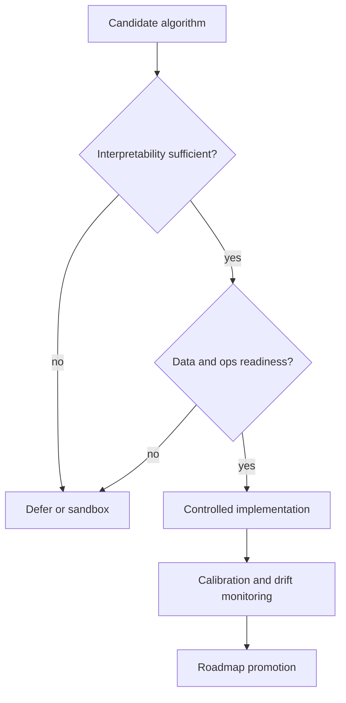
```mermaid
flowchart TD
  A[Candidate algorithm] --> B{Interpretability sufficient?}
  B -->|no| C[Defer or sandbox]
  B -->|yes| D{Data and ops readiness?}
  D -->|no| C
  D -->|yes| E[Controlled implementation]
  E --> F[Calibration and drift monitoring]
  F --> G[Roadmap promotion]
```

### Future GOP-Compatible Formula (Planned)

$$
GOP(p) = \frac{1}{T_p}\sum_{t \in p} \log P(p \mid o_t) - \max_{q \ne p}\frac{1}{T_p}\sum_{t \in p} \log P(q \mid o_t)
$$

This formulation is included because it aligns with CAPT literature and supports phoneme-level diagnosis beyond the current heuristic approximation.

### M1 to M3 Algorithm Progression

| <sub>#</sub> | <sub>Stage</sub> | <sub>Method</sub> | <sub>What Improves</sub> | <sub>Risks</sub> |
| --- | --- | --- | --- | --- |
| <sub>1</sub> | <sub>M1</sub> | <sub>Deterministic weighted heuristics</sub> | <sub>Speed, transparency, and debuggability</sub> | <sub>Limited phonetic depth</sub> |
| <sub>2</sub> | <sub>M2</sub> | <sub>Lexicon-backed phoneme checks</sub> | <sub>Better target-specific diagnostics</sub> | <sub>Lexicon and alignment complexity</sub> |
| <sub>3</sub> | <sub>M3</sub> | <sub>GOP-like or segmentation-free features</sub> | <sub>Higher diagnostic fidelity and benchmarking</sub> | <sub>Model and data pipeline overhead</sub> |

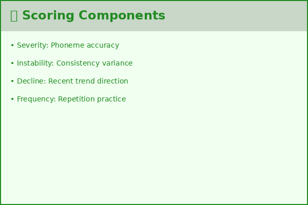

### Component Scoring Formula and Rationale

The weighted component model combines phoneme accuracy, fluency stability, and consistency variance into a single interpretable score. Rather than hiding complexity behind a black-box confidence number, this approach surfaces exactly what contributed to each learner's evaluation. A child who scores 0.72 overall with strong phoneme (0.80) but low fluency (0.60) gets clear guidance: articulation is solid, but practice should focus on rhythm and continuity.

Consistency is computed from the variance of recent attempts for the same target. This dimension captures whether a learner can repeat success or if high scores are one-off flukes. It also helps clinicians spot learners who need more drill repetition versus those ready to move to the next target. The formula remains tunable: if clinical feedback suggests different weight distributions, that change is isolated to the weighted aggregation line in AiSpeechService.

### Formula and Algorithm Catalog (CAPT, MDD, and Speech Therapy)

| <sub>#</sub> | <sub>Algorithm or Formula</sub> | <sub>Expression</sub> | <sub>Therapy Use</sub> |
| --- | --- | --- | --- |
| <sub>1</sub> | <sub>Weighted composite score</sub> | <sub>$S=0.60S_p+0.25S_f+0.15S_c$</sub> | <sub>Combines articulation, fluency, and stability in one score</sub> |
| <sub>2</sub> | <sub>Classic GOP</sub> | <sub>$\text{GOP}(p)=\frac{1}{T_p}\sum\log P(p\mid o_t)-\max_{q\neq p}\frac{1}{T_p}\sum\log P(q\mid o_t)$</sub> | <sub>Phone-level mispronunciation feedback</sub> |
| <sub>3</sub> | <sub>Segmentation-free GOP</sub> | <sub>Alignment-free posterior scoring</sub> | <sub>Reduces forced-alignment error in MDD</sub> |
| <sub>4</sub> | <sub>Word Error Rate</sub> | <sub>$\text{WER}=\frac{S+D+I}{N}$</sub> | <sub>Checks transcript quality before scoring</sub> |
| <sub>5</sub> | <sub>Character Error Rate</sub> | <sub>$\text{CER}=\frac{S_c+D_c+I_c}{N_c}$</sub> | <sub>Fine-grained transcript quality check</sub> |
| <sub>6</sub> | <sub>F1 score for MDD</sub> | <sub>$F1=\frac{2PR}{P+R}$</sub> | <sub>Balances precision and recall for detection</sub> |
| <sub>7</sub> | <sub>Dynamic Time Warping</sub> | <sub>$D(i,j)=d(i,j)+\min\{D(i-1,j),D(i,j-1),D(i-1,j-1)\}$</sub> | <sub>Aligns variable speaking rate signals</sub> |
| <sub>8</sub> | <sub>Exponential smoothing</sub> | <sub>$E_t=\alpha x_t+(1-\alpha)E_{t-1}$</sub> | <sub>Smooths noisy progress trajectories</sub> |
| <sub>9</sub> | <sub>z-score normalization</sub> | <sub>$z=\frac{x-\mu}{\sigma}$</sub> | <sub>Normalizes cross-target score comparisons</sub> |
| <sub>10</sub> | <sub>Flesch Reading Ease</sub> | <sub>$206.835-1.015\frac{W}{S}-84.6\frac{SYL}{W}$</sub> | <sub>Keeps parent summaries understandable</sub> |
| <sub>11</sub> | <sub>SNR estimate</sub> | <sub>$\text{SNR}_{dB}=10\log_{10}(P_s/P_n)$</sub> | <sub>Flags noisy captures before scoring</sub> |
| <sub>12</sub> | <sub>Adaptive repetition interval</sub> | <sub>$I_{n+1}=I_n(1+\alpha R_n-\beta E_n)$</sub> | <sub>Improves home drill scheduling quality</sub> |

| <sub>#</sub> | <sub>Algorithm or Formula</sub> | <sub>Project Value</sub> | <sub>Reference</sub> |
| --- | --- | --- | --- |
| <sub>1</sub> | <sub>Weighted composite score</sub> | <sub>Current core scoring contract</sub> | <sub><a href="https://arxiv.org/abs/2506.19315">JCAPT</a></sub> |
| <sub>2</sub> | <sub>Classic GOP</sub> | <sub>Planned path to stronger diagnostics</sub> | <sub><a href="https://www.isca-archive.org/interspeech_2019/sudhakara19_interspeech.html">Sudhakara et al. 2019</a></sub> |
| <sub>3</sub> | <sub>Segmentation-free GOP</sub> | <sub>Candidate for M3+ scoring layer</sub> | <sub><a href="https://arxiv.org/abs/2507.16838">Cao et al. 2025</a></sub> |
| <sub>4</sub> | <sub>Word Error Rate</sub> | <sub>Validates STT adapter quality gates</sub> | <sub><a href="https://en.wikipedia.org/wiki/Word_error_rate">WER definition</a></sub> |
| <sub>5</sub> | <sub>Character Error Rate</sub> | <sub>Supports phoneme-proxy transcript checks</sub> | <sub><a href="https://apxml.com/courses/applied-speech-recognition/chapter-6-evaluating-deploying-asr-systems/asr-performance-metrics-wer-cer">ASR metrics reference</a></sub> |
| <sub>6</sub> | <sub>F1 score for MDD</sub> | <sub>Benchmark-ready evaluation metric</sub> | <sub><a href="https://arxiv.org/abs/2606.05569">Tu et al. 2026</a></sub> |
| <sub>7</sub> | <sub>Dynamic Time Warping</sub> | <sub>Useful for constrained drill alignment</sub> | <sub><a href="https://en.wikipedia.org/wiki/Dynamic_time_warping">DTW reference</a></sub> |
| <sub>8</sub> | <sub>Exponential smoothing</sub> | <sub>Improves dashboard trend stability</sub> | <sub><a href="https://otexts.com/fpp3/ses.html">SES reference</a></sub> |
| <sub>9</sub> | <sub>z-score normalization</sub> | <sub>Improves mixed-target comparability</sub> | <sub><a href="https://en.wikipedia.org/wiki/Standard_score">z-score reference</a></sub> |
| <sub>10</sub> | <sub>Flesch Reading Ease</sub> | <sub>Improves parent-report readability</sub> | <sub><a href="https://en.wikipedia.org/wiki/Flesch%E2%80%93Kincaid_readability_tests">Flesch reference</a></sub> |
| <sub>11</sub> | <sub>SNR estimate</sub> | <sub>Prevents noisy-input mis-scoring</sub> | <sub><a href="https://en.wikipedia.org/wiki/Signal-to-noise_ratio">SNR reference</a></sub> |
| <sub>12</sub> | <sub>Adaptive repetition interval</sub> | <sub>Improves assignment carryover plans</sub> | <sub><a href="https://www.supermemo.com/en/archives1990-2015/english/ol/sm2">SM-2 spacing concept</a></sub> |

This table is designed as a practical algorithm menu rather than a theory dump. The core idea is to separate formulas needed immediately for production-safe behavior from formulas that should be introduced only when evaluation infrastructure is ready. For the current app, weighted composite scoring, consistency estimation, and trend smoothing have the strongest implementation value because they directly improve user-facing reliability.

The second key point is that CAPT/MDD quality is often bottlenecked by alignment and data quality, not only by model architecture. That is why metrics like WER, CER, SNR, and F1 are listed alongside GOP and joint modeling methods. In practice, SpeechBuddyAI should gate advanced scoring with data-quality checks and clear diagnostics so users understand when a score is high-confidence versus low-confidence.

## Public Libraries and API Strategy

The project roadmap intentionally prioritizes free and public resources so the system remains reproducible for open development.

This strategy reduces lock-in risk while the scoring system is still evolving. During early and mid milestones, reproducibility and debuggability are more valuable than provider-specific optimization. Public tools also make issue triage easier because contributors can replicate behavior without private enterprise contracts.

### Integration Candidates

| <sub>#</sub> | <sub>Tool</sub> | <sub>Type</sub> | <sub>License or Terms</sub> | <sub>Why Consider It</sub> |
| --- | --- | --- | --- | --- |
| <sub>1</sub> | <sub>Vosk</sub> | <sub>Offline STT toolkit</sub> | <sub>Apache-2.0</sub> | <sub>On-device recognition for privacy-first deployments</sub> |
| <sub>2</sub> | <sub>whisper.cpp</sub> | <sub>Offline ASR inference engine</sub> | <sub>MIT</sub> | <sub>Broad platform support and efficient local inference</sub> |
| <sub>3</sub> | <sub>CMUdict</sub> | <sub>Pronunciation lexicon</sub> | <sub>Free unrestricted use notice</sub> | <sub>Canonical references for phone-level logic</sub> |
| <sub>4</sub> | <sub>Datamuse API</sub> | <sub>Word association and suggestions</sub> | <sub>Public usage with limits and key timeline notes</sub> | <sub>Practice list generation and topic expansion</sub> |

> [!IMPORTANT]
> Datamuse policy text currently notes API-key-related changes from 2027 and request limits, so production integration should include caching and fallback behavior.

### External Project Pattern Mapping

| <sub>#</sub> | <sub>Open Project</sub> | <sub>Pattern</sub> | <sub>Practical Adoption in SpeechBuddyAI</sub> |
| --- | --- | --- | --- |
| <sub>1</sub> | <sub>fulldecent/vowel-practice</sub> | <sub>Focused vowel visual training</sub> | <sub>Add optional vowel-target mini mode</sub> |
| <sub>2</sub> | <sub>assinscreedFC/ortholyse</sub> | <sub>Local-first transcription and metrics</sub> | <sub>Strengthen local evaluation and reporting pathways</sub> |
| <sub>3</sub> | <sub>KorayUlusan/delayed-auditory-feedback-online</sub> | <sub>DAF intervention tooling</sub> | <sub>Add configurable fluency support mode</sub> |

> [!NOTE]
> These are architecture inspirations and workflow ideas, not source-code reuse.

### Library Selection: Why These and Not Others Yet

| <sub>#</sub> | <sub>Library or API</sub> | <sub>Selected Because</sub> | <sub>Why Not the Common Alternative Yet</sub> | <sub>Adoption Gate</sub> |
| --- | --- | --- | --- | --- |
| <sub>1</sub> | <sub>Vosk</sub> | <sub>Offline and privacy-friendly deployment model</sub> | <sub>Cloud-first APIs can raise policy and latency constraints</sub> | <sub>Target-device benchmark passes</sub> |
| <sub>2</sub> | <sub>whisper.cpp</sub> | <sub>Strong local inference ecosystem with broad hardware paths</sub> | <sub>Hosted-only options reduce offline resilience</sub> | <sub>Real-time performance validated on baseline devices</sub> |
| <sub>3</sub> | <sub>CMUdict</sub> | <sub>Open lexicon for deterministic phoneme mappings</sub> | <sub>Proprietary lexicons limit reproducibility</sub> | <sub>Coverage verified for target therapy set</sub> |
| <sub>4</sub> | <sub>Datamuse API</sub> | <sub>Useful for constrained word expansion</sub> | <sub>Custom corpus service would add unnecessary ops overhead</sub> | <sub>Caching and fallback behavior implemented</sub> |

## Collapsible API Reference

<details open>
<summary>Speech Evaluation Contracts (Current and Planned)</summary>

### 1) Practice Attempt Scoring

| <sub>#</sub> | <sub>Contract</sub> | <sub>Input</sub> | <sub>Output</sub> | <sub>Current Status</sub> |
| --- | --- | --- | --- | --- |
| <sub>1</sub> | <sub>evaluateAttempt</sub> | <sub>targetSound, transcript</sub> | <sub>phoneme, fluency, consistency, overall, errorPattern, provider, confidence</sub> | <sub>Implemented through M5.1</sub> |
| <sub>2</sub> | <sub>persistAttempt</sub> | <sub>ProgressEntry payload</sub> | <sub>stored entry id and timestamp</sub> | <sub>Implemented in M1</sub> |
| <sub>3</sub> | <sub>listAttempts</sub> | <sub>optional target filter</sub> | <sub>ordered attempt history</sub> | <sub>Implemented in M1</sub> |

> [!TIP]
> Keep output fields stable so model upgrades can be drop-in replacements.

### 2) Practice Content Generation

| <sub>#</sub> | <sub>Contract</sub> | <sub>Input</sub> | <sub>Output</sub> | <sub>Current Status</sub> |
| --- | --- | --- | --- | --- |
| <sub>1</sub> | <sub>generatePracticeWords</sub> | <sub>targetSound</sub> | <sub>word list for drills</sub> | <sub>Implemented baseline</sub> |
| <sub>2</sub> | <sub>generateAssignments</sub> | <sub>historical weak patterns</sub> | <sub>home plan with rationale</sub> | <sub>Implemented in M2 baseline</sub> |

### 3) Notes and Reporting

| <sub>#</sub> | <sub>Contract</sub> | <sub>Input</sub> | <sub>Output</sub> | <sub>Current Status</sub> |
| --- | --- | --- | --- | --- |
| <sub>1</sub> | <sub>summarizeSessionNotes</sub> | <sub>free text notes</sub> | <sub>structured summary</sub> | <sub>Implemented in M5 baseline</sub> |
| <sub>2</sub> | <sub>exportReport</sub> | <sub>session id and format</sub> | <sub>shareable artifact</sub> | <sub>Implemented in M5 baseline</sub> |

</details>

<details>
<summary>Assignment and Audit Contracts (Expanded)</summary>

### 4) Assignment Snapshot Contracts

| <sub>#</sub> | <sub>Contract</sub> | <sub>Input</sub> | <sub>Output</sub> | <sub>Failure Mode</sub> |
| --- | --- | --- | --- | --- |
| <sub>1</sub> | <sub>generateHomeAssignment</sub> | <sub>target history, weak patterns, settings</sub> | <sub>assignment targets with rationale and confidence metadata</sub> | <sub>Returns conservative output when evidence is sparse</sub> |
| <sub>2</sub> | <sub>saveSnapshot</sub> | <sub>assignment payload plus traces and version info</sub> | <sub>persisted snapshot id and timestamp</sub> | <sub>Falls back to minimal snapshot if optional fields are unavailable</sub> |
| <sub>3</sub> | <sub>loadSnapshots</sub> | <sub>date range or target filters</sub> | <sub>ordered snapshot history</sub> | <sub>Returns empty set for unsupported or empty windows</sub> |

### 5) Advisory and Calibration Contracts

| <sub>#</sub> | <sub>Contract</sub> | <sub>Input</sub> | <sub>Output</sub> | <sub>Guardrail Behavior</sub> |
| --- | --- | --- | --- | --- |
| <sub>1</sub> | <sub>buildWeightSuggestion</sub> | <sub>snapshot trend traces and calibration summary</sub> | <sub>advisory weight suggestion artifact</sub> | <sub>No suggestion if minimum history depth is unmet</sub> |
| <sub>2</sub> | <sub>buildCalibrationMetrics</sub> | <sub>snapshot history and realized outcomes</sub> | <sub>next-1 and next-3 reliability summaries</sub> | <sub>Marks low-confidence windows when sample support is thin</sub> |
| <sub>3</sub> | <sub>buildModelAuditSummary</sub> | <sub>longitudinal traces and versioned outputs</sub> | <sub>human-readable drift and reliability summary</sub> | <sub>Highlights caution states instead of forcing recommendations</sub> |

> [!IMPORTANT]
> Advisory contracts are intentionally non-authoritative. They provide evidence-backed suggestions, but final policy changes remain clinician-approved.

</details>

<details>
<summary>Example Response Payload (Illustrative)</summary>

```json
{
  "targetSound": "initial r",
  "transcript": "rain rabbit",
    "provider": "offline-heuristic",
    "confidence": {
        "score": 0.84,
        "band": "High"
    },
  "scores": {
    "phonemeScore": 0.90,
    "fluencyScore": 0.73,
    "consistencyScore": 0.62,
    "overallScore": 0.82
  },
  "errorPattern": "none",
  "trialCount": 4,
  "timestamp": "2026-06-21T10:15:00Z"
}
```

</details>

## GitHub Workflow and Tracking

SpeechBuddyAI now uses roadmap-aligned issue templates and labels so milestone execution can be tracked clearly. This keeps implementation tasks connected to goals like M1 scoring reliability, M2 assignment quality, and M3 trend analytics.

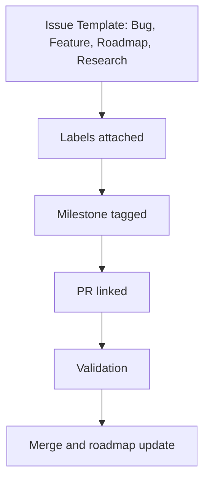
```mermaid
flowchart TD
    A[Issue Template: Bug, Feature, Roadmap, Research] --> B[Labels attached]
    B --> C[Milestone tagged]
    C --> D[PR linked]
    D --> E[Validation]
    E --> F[Merge and roadmap update]
```

### Label Taxonomy Summary

| <sub>#</sub> | <sub>Label Group</sub> | <sub>Example Labels</sub> | <sub>Purpose</sub> |
| --- | --- | --- | --- |
| <sub>1</sub> | <sub>Type</sub> | <sub>type:bug, type:feature, type:task</sub> | <sub>Classify issue intent</sub> |
| <sub>2</sub> | <sub>Status</sub> | <sub>status:triage, status:ready, status:blocked</sub> | <sub>Track workflow state</sub> |
| <sub>3</sub> | <sub>Domain</sub> | <sub>domain:therapy-core, domain:ai-integration</sub> | <sub>Map workstream ownership</sub> |
| <sub>4</sub> | <sub>Roadmap</sub> | <sub>roadmap:m1 to roadmap:m5</sub> | <sub>Tie work to roadmap milestone</sub> |
| <sub>5</sub> | <sub>Priority</sub> | <sub>priority:p0 to priority:p3</sub> | <sub>Support execution ordering</sub> |

> [!IMPORTANT]
> Every issue should include both technical acceptance criteria and clinical rationale.

### GitHub Markdown Features Used in This README

| <sub>#</sub> | <sub>Feature</sub> | <sub>Why It Is Used Here</sub> |
| --- | --- | --- |
| <sub>1</sub> | <sub>Shields badges</sub> | <sub>Surface status and stack metadata quickly</sub> |
| <sub>2</sub> | <sub>GitHub alerts</sub> | <sub>Highlight risk and guidance clearly</sub> |
| <sub>3</sub> | <sub>Mermaid diagrams</sub> | <sub>Represent architecture and workflow clearly</sub> |
| <sub>4</sub> | <sub>Collapsible details blocks</sub> | <sub>Keep README readable with deep content</sub> |
| <sub>5</sub> | <sub>Math blocks</sub> | <sub>Document scoring formulas unambiguously</sub> |
| <sub>6</sub> | <sub>Dense comparison tables</sub> | <sub>Accelerate contributor decision-making</sub> |

> [!NOTE]
> GitHub docs confirm support for Mermaid diagrams, alerts, and details blocks in Markdown contexts like repository files and discussions.

## Research Citations

This list captures articles and arXiv references used to inform architecture and algorithm choices.

### CAPT, MDD, and Scoring Papers (Linked)

| <sub>#</sub> | <sub>Paper</sub> | <sub>Focus Area</sub> | <sub>Practical Use in Project</sub> |
| --- | --- | --- | --- |
| <sub>1</sub> | <sub>Korzekwa et al.</sub> | <sub>Synthetic speech for CAPT data augmentation</sub> | <sub>Guides augmentation strategy for MDD robustness</sub> |
| <sub>2</sub> | <sub>Zhang et al. speechocean762</sub> | <sub>Open benchmark corpus for pronunciation assessment</sub> | <sub>Supports offline benchmark alignment</sub> |
| <sub>3</sub> | <sub>Yang et al. JCAPT</sub> | <sub>Joint APA and MDD modeling</sub> | <sub>Guides combined quality and diagnosis outputs</sub> |
| <sub>4</sub> | <sub>Cao et al. GOP-SF</sub> | <sub>Segmentation-free GOP and phone-level assessment</sub> | <sub>Candidate M3+ upgrade for diagnosis fidelity</sub> |
| <sub>5</sub> | <sub>Tu et al.</sub> | <sub>Domain-aware statistical graph MDD</sub> | <sub>Supports language-specific confusion modeling</sub> |
| <sub>6</sub> | <sub>Sudhakara et al.</sub> | <sub>Improved GOP with DNN-HMM transitions</sub> | <sub>Strong baseline for interpretable scoring</sub> |

| <sub>#</sub> | <sub>Paper</sub> | <sub>DOI</sub> | <sub>Direct Link</sub> |
| --- | --- | --- | --- |
| <sub>1</sub> | <sub>Korzekwa et al.</sub> | <sub>10.48550/arXiv.2207.00774</sub> | <sub><a href="https://arxiv.org/abs/2207.00774">arXiv 2207.00774</a></sub> |
| <sub>2</sub> | <sub>Zhang et al. speechocean762</sub> | <sub>10.48550/arXiv.2104.01378</sub> | <sub><a href="https://arxiv.org/abs/2104.01378">arXiv 2104.01378</a></sub> |
| <sub>3</sub> | <sub>Yang et al. JCAPT</sub> | <sub>10.48550/arXiv.2506.19315</sub> | <sub><a href="https://arxiv.org/abs/2506.19315">arXiv 2506.19315</a></sub> |
| <sub>4</sub> | <sub>Cao et al. GOP-SF</sub> | <sub>10.48550/arXiv.2507.16838</sub> | <sub><a href="https://arxiv.org/abs/2507.16838">arXiv 2507.16838</a></sub> |
| <sub>5</sub> | <sub>Tu et al.</sub> | <sub>10.48550/arXiv.2606.05569</sub> | <sub><a href="https://arxiv.org/abs/2606.05569">arXiv 2606.05569</a></sub> |
| <sub>6</sub> | <sub>Sudhakara et al.</sub> | <sub>Interspeech 2019</sub> | <sub><a href="https://www.isca-archive.org/interspeech_2019/sudhakara19_interspeech.html">ISCA page</a></sub> |

This table translates research into implementation value. Instead of listing papers as passive references, each row maps a publication to a concrete project decision, such as benchmark alignment, model choice, or diagnostic strategy. This keeps research work tied to shipping outcomes and avoids academic drift where citations exist but do not change the product.

The linked format also helps team execution. When a milestone task claims to implement "GOP-like scoring" or "domain-aware confusion modeling," contributors can open the exact source quickly and keep terminology consistent across issues, pull requests, and README updates. That consistency improves review quality and keeps AI-related roadmap changes auditable.

### Additional Reading for Calibration and Reliability

| <sub>#</sub> | <sub>Topic</sub> | <sub>Why It Matters Here</sub> | <sub>Reference</sub> |
| --- | --- | --- | --- |
| <sub>1</sub> | <sub>Model calibration</sub> | <sub>Helps interpret whether confidence signals align with observed outcomes</sub> | <sub><a href="https://arxiv.org/abs/1706.04599">Guo et al. 2017, On Calibration of Modern Neural Networks</a></sub> |
| <sub>2</sub> | <sub>Uncertainty quality</sub> | <sub>Supports safe use of confidence intervals in decision support contexts</sub> | <sub><a href="https://arxiv.org/abs/1807.00263">Ovadia et al. 2019, Can You Trust Your Model's Uncertainty?</a></sub> |
| <sub>3</sub> | <sub>Selective prediction and abstention</sub> | <sub>Motivates suppression behavior when evidence is insufficient</sub> | <sub><a href="https://arxiv.org/abs/2401.06495">Recent survey on uncertainty and abstention</a></sub> |
| <sub>4</sub> | <sub>Speech assessment benchmarking</sub> | <sub>Connects algorithm choices to realistic CAPT evaluation constraints</sub> | <sub><a href="https://arxiv.org/abs/2104.01378">speechocean762 benchmark paper</a></sub> |

### AI and UI Improvement Matrix (Project-Focused)

| <sub>#</sub> | <sub>Improvement Theme</sub> | <sub>AI or UI Direction</sub> | <sub>Near-Term Action</sub> | <sub>Expected User Impact</sub> |
| --- | --- | --- | --- | --- |
| <sub>1</sub> | <sub>Input quality gating</sub> | <sub>AI reliability</sub> | <sub>Add SNR/noise pre-check before scoring</sub> | <sub>Fewer misleading low-confidence scores</sub> |
| <sub>2</sub> | <sub>Provider confidence visibility</sub> | <sub>AI transparency</sub> | <sub>Show scoring provider and confidence band in Practice and Progress</sub> | <sub>Users understand score reliability shifts</sub> |
| <sub>3</sub> | <sub>Weak-pattern assignment tuning</sub> | <sub>AI personalization</sub> | <sub>Rank home drills by error frequency and recency</sub> | <sub>More relevant home plans and better carryover</sub> |
| <sub>4</sub> | <sub>Trend explainability</sub> | <sub>UI analytics</sub> | <sub>Add trajectory interpretation text beside chart bars</sub> | <sub>Faster clinician and parent interpretation</sub> |
| <sub>5</sub> | <sub>Session comparison view</sub> | <sub>UI workflow</sub> | <sub>Add last-session vs current-session cards</sub> | <sub>Quicker in-session progress review</sub> |
| <sub>6</sub> | <sub>Adaptive prompt difficulty</sub> | <sub>AI adaptation</sub> | <sub>Escalate from words to phrases by sustained consistency</sub> | <sub>Better challenge calibration</sub> |
| <sub>7</sub> | <sub>Parent summary readability</sub> | <sub>UI communication</sub> | <sub>Apply readability target in M5 reports</sub> | <sub>Better caregiver understanding and adherence</sub> |
| <sub>8</sub> | <sub>Error pattern drill cards</sub> | <sub>UI coaching</sub> | <sub>Attach micro-coaching tips to each error tag</sub> | <sub>More actionable home practice</sub> |
| <sub>9</sub> | <sub>Offline-first resilience UX</sub> | <sub>AI infra plus UI</sub> | <sub>Display fallback state and retry options</sub> | <sub>Smoother sessions under poor connectivity</sub> |
| <sub>10</sub> | <sub>Benchmark mode</sub> | <sub>AI evaluation</sub> | <sub>Add developer mode to compute WER and F1</sub> | <sub>Faster evidence-based model iteration</sub> |

The project should evolve AI and UI together, not as separate tracks. If scoring sophistication improves without clear UI explanation, users will trust the app less. If UI improves without better scoring controls, users will get polished but unreliable feedback. The matrix above keeps those two dimensions synchronized in planning and implementation.

A practical execution approach is to pair each AI enhancement with one visible UX artifact. For example, when fallback scoring is added, show provider source in the result card; when trend smoothing is added, expose the interpretation text that explains why a trend is labeled improving, stable, or declining. This pairing improves usability and creates better testability in reviews.

### Tooling and Documentation References

1. GitHub Docs - Creating diagrams (Mermaid, GeoJSON, TopoJSON, STL)
2. GitHub Docs - Organizing information with collapsed sections
3. Vosk API documentation and repository
4. whisper.cpp documentation and repository
5. CMUdict repository and license notice
6. Datamuse API documentation

> [!TIP]
> Keep this section versioned as new roadmap decisions are made, so architectural tradeoffs remain evidence-backed and reviewable.


### Longitudinal Progress Tracking and Filtering

The Progress dashboard aggregates all persisted attempts into a scrollable history and scoped trend view. Clinicians and families can filter by target sound and date range to isolate a practice window. The timeline charts show overall score trajectories with smoothed trend lines to reduce visual noise from single high or low attempts. This view transforms the raw practice loop into a narrative: the learner has been working on /r/ for six weeks, shows upward trend, but with high variance on Fridays suggesting fatigue effects.

The dashboard supports both recent-attempt summaries ("last 5 practice sessions") and full history queries. Each row displays phoneme, fluency, consistency, and overall scores plus the raw transcript, making it easy to spot patterns. For instance, does this learner do better in isolation (/r/ alone) than in blends or final position? Those phonemes are taggable in future milestones, but the data structure already supports filtering by sound family or position once transcripts are parsed.

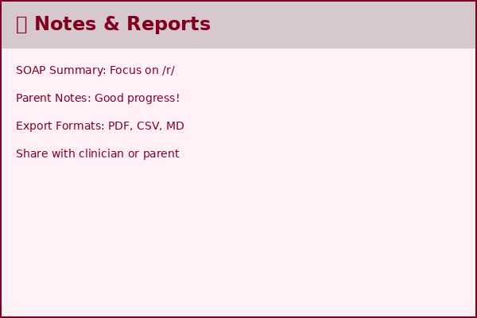

### Clinician Reporting and Parent Summaries

The Notes page is where clinicians compose session summaries, reference the comparison with the previous session, and export finalized reports for parents and other professionals. SOAP structure (Subjective, Objective, Assessment, Plan) guides note writing while auto-populating with longitudinal metrics. The comparison builder highlights wins (e.g., +15% overall from last week) and flags regression risks (consistency drift on /s/) so the Plan section can be precise and evidence-based.

Parent summaries are auto-generated in plain language, avoiding clinical jargon while preserving honesty. Instead of "Low consistency score," the parent reads: "Practice is coming along. The most recent session showed steady attempts on /r/, which is great progress toward independent carryover." Reports can be exported in plain text, Markdown, or CSV formats, making them shareable with other professionals or suitable for EHR integration. Clinicians can also manually edit and save custom notes, which are persisted alongside the auto-generated ones for future reference.

## Operations and Reliability Playbook

This section explains how to run the app with fewer surprises in real workflows. The point is not just to make features work once, but to keep behavior stable across devices, sessions, and scoring updates.

| <sub>#</sub> | <sub>Operational Goal</sub> | <sub>How to Check It</sub> | <sub>Expected Signal</sub> | <sub>Escalation Path</sub> |
| --- | --- | --- | --- | --- |
| <sub>1</sub> | <sub>Stable scoring outputs</sub> | <sub>Repeat same input across test runs</sub> | <sub>Similar component outputs within expected variance</sub> | <sub>Inspect scoring formula version and trace metadata</sub> |
| <sub>2</sub> | <sub>Reliable persistence</sub> | <sub>Create attempts then reload Progress view</sub> | <sub>Entries remain available with correct ordering</sub> | <sub>Review SQLite initialization and migration logs</sub> |
| <sub>3</sub> | <sub>Safe adaptation recommendations</sub> | <sub>Review advisory cards in Notes over multiple snapshots</sub> | <sub>No recommendation when history depth is insufficient</sub> | <sub>Adjust guardrail settings and re-evaluate</sub> |
| <sub>4</sub> | <sub>Trustworthy confidence reporting</sub> | <sub>Compare CI visibility across sparse vs dense targets</sub> | <sub>CIs suppressed for low-sample cases</sub> | <sub>Revisit minimum sample threshold in Settings</sub> |

| <sub>#</sub> | <sub>Common Symptom</sub> | <sub>Likely Cause</sub> | <sub>First Fix</sub> | <sub>Long-Term Fix</sub> |
| --- | --- | --- | --- | --- |
| <sub>1</sub> | <sub>Score feels inconsistent day to day</sub> | <sub>Low history depth for target or variable transcript quality</sub> | <sub>Increase repetitions for same target and verify input format</sub> | <sub>Add stronger input quality checks and coaching hints</sub> |
| <sub>2</sub> | <sub>No advisory suggestion appears</sub> | <sub>Guardrails intentionally blocked recommendation</sub> | <sub>Confirm snapshot history depth and calibration support</sub> | <sub>Tune thresholds only with clinician review evidence</sub> |
| <sub>3</sub> | <sub>Report values differ from expectation</sub> | <sub>Formula version or snapshot window mismatch</sub> | <sub>Compare report period and stored version tags</sub> | <sub>Add version-annotated report headers and tests</sub> |
| <sub>4</sub> | <sub>Trend looks flat despite progress</sub> | <sub>Smoothing or mixed-target aggregation effect</sub> | <sub>Filter by target sound and inspect component-level lines</sub> | <sub>Add per-target trajectory cards by default</sub> |

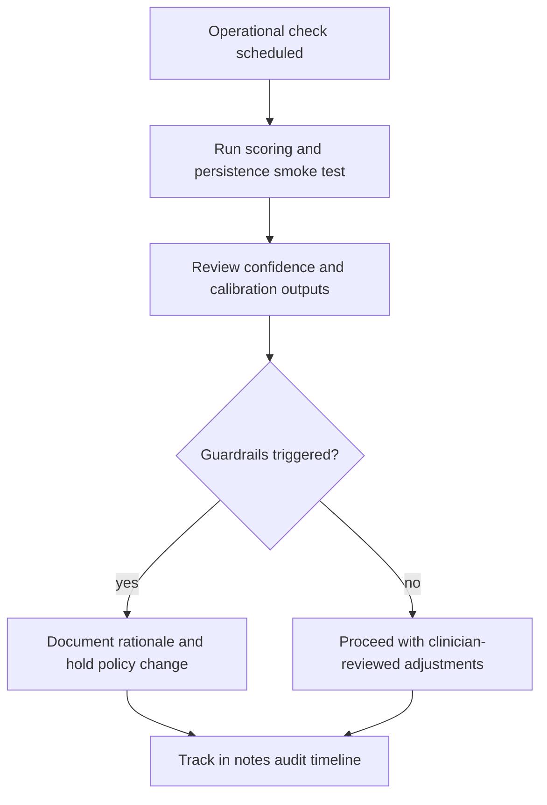
```mermaid
flowchart TD
  A[Operational check scheduled] --> B[Run scoring and persistence smoke test]
  B --> C[Review confidence and calibration outputs]
  C --> D{Guardrails triggered?}
  D -->|yes| E[Document rationale and hold policy change]
  D -->|no| F[Proceed with clinician-reviewed adjustments]
  E --> G[Track in notes audit timeline]
  F --> G
```

> [!NOTE]
> In a clinical context, conservative behavior is usually a feature, not a bug. A blocked recommendation can indicate healthy governance.

> [!TIP]
> Keep at least one stable benchmark target in every session. It provides a practical reference point for spotting drift versus true learner change.

## Build, Run, and Practical Notes

### Prerequisites

1. .NET SDK and MAUI workloads available on the host machine.
2. Platform SDKs for targets you plan to run.
3. Local filesystem write access for app data persistence.

### Build

```bash
dotnet restore
dotnet build
```

### Practical M1 Verification Steps

1. Open Practice tab.
2. Enter target sound and transcript.
3. Press Score Attempt.
4. Confirm component scores and status text update.
5. Open Progress tab and verify entry appears with same component values.

### Next Milestone-Focused Steps

- [x] M1.1: move JSON persistence to SQLite while preserving output contracts
- [x] M2: add assignment generation from weak pattern history
- [x] M3: add charted trend analysis and score trajectory interpretation
- [x] M4: add offline-first adapter interface with fallback strategy
- [x] M5: add clinician report and parent summary pipeline
- [x] M5.1: add provider and confidence visibility in Practice and Progress UI
- [x] M5.2: add clinician-tunable confidence thresholds in Settings
- [x] M5.3: add lightweight tests for confidence and SQLite migration logic
- [x] M6.1: add position-aware phoneme word bank covering 30+ phonemes and blends
- [x] M6.2: persist session notes to SQLite with history view in Notes tab
- [x] M6.3: add home dashboard quick stats (attempts, average, streak, most-improved)
- [x] M6.4: add target-sound filter on Progress dashboard
- [x] M6.5: add real report export and share flow from Notes
- [x] M6.6: add current-session vs previous-session comparison cards in Progress
- [x] M7.1: add per-target confidence-interval reliability thresholds with clinician-defined minimum samples
- [x] M7.2: extend calibration to multi-horizon outcomes (next snapshot and next 3 snapshots)
- [x] M7.3: add dedicated longitudinal model-audit view in Notes with calibration and trace-drift trends
- [x] M7.4: add advisory automatic weight-suggestion logic requiring clinician approval
- [x] M7.5: add snapshot-level scoring-formula versioning for cross-revision audit comparison
- [x] M7.6: tighten advisory weight guardrails with minimum history depth and capped per-update deltas

> [!IMPORTANT]
> Favor backward-compatible output contracts in service responses so historical data and dashboard rendering remain stable across model and storage upgrades.
